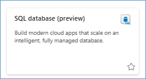
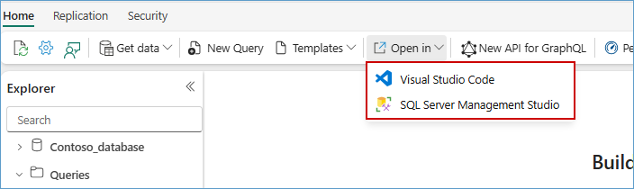

# Workshop: SQL database in Microsoft Fabric

## Overview

#### A Microsoft Workshop from the SQL Server Team

Welcome to the *SQL database in Microsoft Fabric* workshop. This workshop is designed to provide you with a comprehensive understanding of SQL database in Microsoft Fabric and its integration with other services. Throughout this workshop, you will learn how to create, manage, and optimize SQL databases, as well as how to leverage artificial intelligence and build applications using GraphQL API builder.

## Introduction to SQL Database in Fabric

### Understanding SQL Database in Fabric

**SQL database** in Microsoft Fabric is a developer-friendly transactional database, based on **Azure SQL Database**, that allows you to easily create your operational database in Microsoft Fabric. A SQL database in Microsoft Fabric uses the same SQL Database Engine as Azure SQL Database.

SQL database in Fabric is:

- The home in Fabric for OLTP workloads
- Easy to configure and manage
- Set up for analytics by automatically replicating the data into OneLake in near real time
- Integrated with development frameworks and analytics
- Based on the underlying technology of **Mirroring in Fabric**
- Queried in all the same ways as **Azure SQL Database**, plus a **web-based editor in the Fabric portal**

### Key Benefits of Using SQL Database in Fabric
SQL database in Microsoft Fabric is a developer-friendly transactional database based on the Azure SQL Database engine. It is simple, autonomous, secure by default, and AI-integrated. Being part of Microsoft Fabric, it benefits from Fabric's promises and offers tight integration with other workloads within Microsoft Fabric.

With your SQL database in Fabric, you can easily build OLTP applications while minimizing the need to stitch together multiple services to create an end-to-end solution.

When you provision a SQL database, the data is stored in MDF and LDF formats. The data is then automatically replicated into OneLake and converted to Parquet, in an analytics-ready format. This enables downstream scenarios like Data Engineering, Data Science, and more.

#### Sharing
 
Sharing enables ease of access control and management, while security controls like row-level security (RLS), object-level security (OLS) and more make sure you can control access to sensitive information. Sharing also enables secure and democratized decision-making across your organization.
 
By sharing your SQL database, you can grant other users or a group of users, access to a database without giving access to the workspace and the rest of its items. When someone shares a database, they also grant access to the SQL analytics endpoint and associated default semantic model.
 
#### Connect
 
Like other Microsoft Fabric item types, SQL databases rely on Microsoft Entra authentication.
To successfully authenticate to a SQL database, a Microsoft Entra user, a service principal, or their group, must have the Read item permission to the SQL database in Fabric.
 

In addition to the Fabric SQL database Query Editor, you can also connect your Fabric SQL database to your preferred client tools, including SQL Server Management Studio and the mssql extension with Visual Studio Code. 
 
#### Cross-database queries
 
With the data from your SQL database automatically stored in OneLake, you can write cross-database queries, joining data from other SQL databases, mirrored databases, warehouses, and the SQL analytics endpoint in a single T-SQL query. All this is currently possible with queries on the SQL analytics endpoint of the SQL database, or lakehouse.
 
#### Data Engineering with your SQL database in Fabric
 
Microsoft Fabric provides various data engineering capabilities to ensure that your data is easily accessible, well-organized, and high-quality. With Microsoft Fabric Data Engineering, you can:
 
- Create and manage your data as Spark using a SQL database in Fabric.
- Design pipelines to copy data into your SQL database in Fabric.
- Use Spark job definitions to submit batch/streaming jobs to Spark cluster.
- Use notebooks to write code for data preparation and transformation.
 
#### Data Science with your SQL database in Fabric
 
Data Science in Microsoft Fabric empowers users to complete end-to-end data science workflows for the purpose of data enrichment and business insights. You can complete a wide range of activities across the entire data science process, all the way from data exploration, preparation and cleansing to experimentation, modeling, model scoring and serving of predictive insights to BI reports.
 
#### Database portability and deployments with SqlPackage
 
SqlPackage is a cross-platform command line tool that enables database interactions that move entire databases or database objects. The portability (import/export) of a database managed in Azure or in `Fabric ensures that your data is portable should you want to migrate later on. The same portability also enables certain migration scenarios through self-contained database copies (.bacpac) with import/export operations.
 
SqlPackage can enable easy database deployments of incremental changes to database objects (new columns in tables, alterations to existing stored procedures, etc.). SqlPackage can extract a .dacpac file containing the definitions of objects in a database, and publish a .dacpac file to apply that object state to a new or existing database. The publish operation also integrates with SQL projects, which enables offline and more dynamic development cycles for SQL databases.
 
#### Integration with Fabric source control
SQL database is integrated with [Fabric continuous integration/continuous development](https://learn.microsoft.com/fabric/cicd/cicd-overview). You can use the built-in git repository to manage your SQL database.
 
#### Create GraphQL API from Fabric portal
 
You can use the Microsoft Fabric portal to easily [create a GraphQL API](https://learn.microsoft.com/fabric/database/sql/graphql-api) for your SQL database.
 
#### Capacity management
 
You can use the [Microsoft Fabric Capacity Metrics app](https://learn.microsoft.com/fabric/enterprise/metrics-app) to monitor the SQL database usage and consumption in non-trial Fabric capacities.
 
#### Mirroring for Azure SQL Database
 
Do you already have an external database and want to leverage Fabric's integration? You can use Mirroring in Fabric as a low-cost and low-latency solution to bring data from various systems together. You can continuously replicate your existing data estate directly into Fabric's OneLake, including data from an existing [Azure SQL Database](https://learn.microsoft.com/fabric/database/mirrored-database/azure-sql-database).

## Workshop Content
The workshop is divided into several modules, each focusing on a specific aspect of SQL database in Microsoft Fabric. By the end of this workshop, you will have gained practical knowledge and hands-on experience in the following areas:

### 0. [Pre-Requisites](/sqldev/00%20-%20Pre-Requisites/00%20-%20Pre-Requisites.md)

In this module, you will set up the necessary components and configurations required for the workshop. This includes setting up a PowerBI account, enabling Microsoft Fabric Tenant settings, and creating a Microsoft Azure account.

### 1. [Getting Started](/sqldev/01%20-%20Getting%20Started/01%20-%20Getting%20Started.md)

This module covers the basics of getting started with SQL database in Fabric. You will learn how to create a database, and seed the database with initial data that will be used in later modules.

### 2. [Introduction to SQL database in Fabric](/sqldev/02%20-%20Introduction%20to%20SQL%20database%20in%20Fabric/02%20-%20Introduction%20to%20SQL%20database%20in%20Fabric.md)

In this module, you will explore the seamless integration between your SQL database and other artifacts within your Fabric workspace. 

### 3. [Use Copilot with SQL queries](https://github.com/microsoft/Azure-Analytics-and-AI-Engagement/blob/FabCon-Vienna-SQL-database-in-Fabric-Workshop/sqldev/03%20-%20Copilot%20capabilities%20for%20SQL%20database%20in%20Microsoft%20Fabric/03%20-%20Copilot%20capabilities%20for%20SQL%20database%20in%20Microsoft%20Fabric.md)

This module focuses copilot capability of SQL database.

### 4. [Introduction to GraphQL API builder](/sqldev/04%20-%20Introduction%20to%20GraphQL%20API%20builder//04%20-%20Introduction%20to%20GraphQL%20API%20builder.md)

This module introduces the GraphQL API Builder in Fabric SQL and walks you through the process of creating and querying a GraphQL API. You'll learn how to expose data from your SQL tables, preview content, and define custom procedures to support dynamic queries. The examples provided will help you understand how to retrieve and filter product data using GraphQL.

### 5. [RAG Implementation with Azure OpenAI](/sqldev/05%20-%20RAG%20Implementation%20with%20Azure%20OpenAI/05%20-%20RAG%20Implementation%20with%20Azure%20OpenAI.md)

This section explores how to implement Retrieval-Augmented Generation (RAG) using Azure OpenAI and vector-based search. RAG is a powerful architecture that enhances the capabilities of large language models by grounding their responses in external knowledge sources.

### 6. [Creating a Power BI Report from a SQL Database in Microsoft Fabric with Copilot](https://github.com/microsoft/Azure-Analytics-and-AI-Engagement/blob/FabCon-Vienna-SQL-database-in-Fabric-Workshop/sqldev/06%20-%20PowerBI%20report%20using%20semantic%20model/06.%20Build%20PowerBI%20reports%20using%20copilot.md)

In this module, you will learn how to create reports in Power BI using a SQL database in Microsoft Fabric with the help of Copilot

### 7. [Sentiment Analysis with PowerBI and Translytical Taskflows](/sqldev/07%20-%20Sentiment%20Analysis%20with%20PowerBI%20and%20Translytical%20Taskflows//07%20-%20Sentiment%20Analysis%20with%20PowerBI%20and%20Translytical%20Taskflows.md)

In this exercise you will build on the examples from the previous exercise to **score for sentiment** user reviews of products for AdventureWorks.  You will then use Translytical Taskflows to create a **user data function**,**embed it within a Power BI report**, and **respond to the reviews** in order to determine if any actions or follow up is needed by you, the AdventureWorks employee, who owns the product.

### 8. [ALM - Github Source Control](/sqldev/08%20-%20ALM%20-%20Github%20Source%20Control/08%20-%20ALM%20-%20Github%20Source%20Control.md)
In this module, you will learn about managing the lifecycle of your application using source control. You will also learn how to monitor and maintain your SQL database in Fabric, including setting up Git integration, linking GitHub repositories to Azure DevOps, and synchronizing your workspace with the Git branch.

### 9. [Security - Access Management](/sqldev/09%20-%20Security%20-%20Access%20Management/Data%20Security%20and%20Access%20Management.md)

In this exercise, you will explore **Microsoft Fabric workspace roles** and **SQL native access controls** to effectively manage user permissions to drive down compliance alerts.

### 10. [Monitor your SQL database](/sqldev/10%20-%20Monitor%20your%20SQL%20database/10%20-%20Monitor%20your%20SQL%20database.md)

In this exercise, you will learn to monitor SQL database performance and CU usage.

 

## Contributing

This project welcomes contributions and suggestions.  Most contributions require you to agree to a
Contributor License Agreement (CLA) declaring that you have the right to, and actually do, grant us
the rights to use your contribution. For details, visit https://cla.opensource.microsoft.com.

When you submit a pull request, a CLA bot will automatically determine whether you need to provide
a CLA and decorate the PR appropriately (e.g., status check, comment). Simply follow the instructions
provided by the bot. You will only need to do this once across all repos using our CLA.

This project has adopted the [Microsoft Open Source Code of Conduct](https://opensource.microsoft.com/codeofconduct/).
For more information see the [Code of Conduct FAQ](https://opensource.microsoft.com/codeofconduct/faq/) or
contact [opencode@microsoft.com](mailto:opencode@microsoft.com) with any additional questions or comments.

## Legal Notices

### License
Microsoft and any contributors grant you a license to the Microsoft documentation and other content in this repository under the [Creative Commons Attribution 4.0 International Public License](https://creativecommons.org/licenses/by/4.0/legalcode), see [the LICENSE file](https://github.com/MicrosoftDocs/mslearn-tailspin-spacegame-web/blob/master/LICENSE), and grant you a license to any code in the repository under [the MIT License](https://opensource.org/licenses/MIT), see the [LICENSE-CODE file](https://github.com/MicrosoftDocs/mslearn-tailspin-spacegame-web/blob/master/LICENSE-CODE).

Microsoft, Windows, Microsoft Azure and/or other Microsoft products and services referenced in the documentation
may be either trademarks or registered trademarks of Microsoft in the United States and/or other countries.
The licenses for this project do not grant you rights to use any Microsoft names, logos, or trademarks.
Microsoft's general trademark guidelines can be found at http://go.microsoft.com/fwlink/?LinkID=254653.

Privacy information can be found at https://privacy.microsoft.com/

Microsoft and any contributors reserve all other rights, whether under their respective copyrights, patents,
or trademarks, whether by implication, estoppel or otherwise.

---
