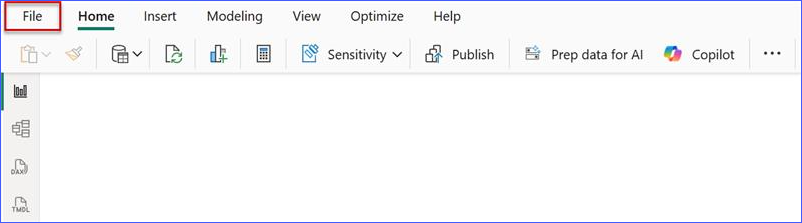
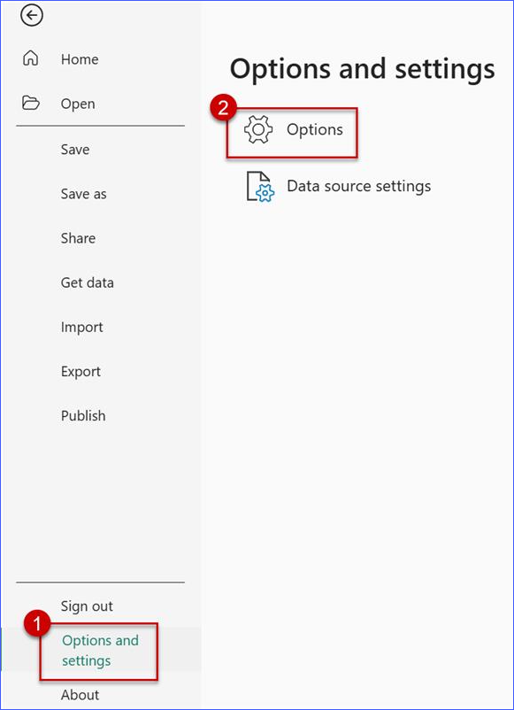
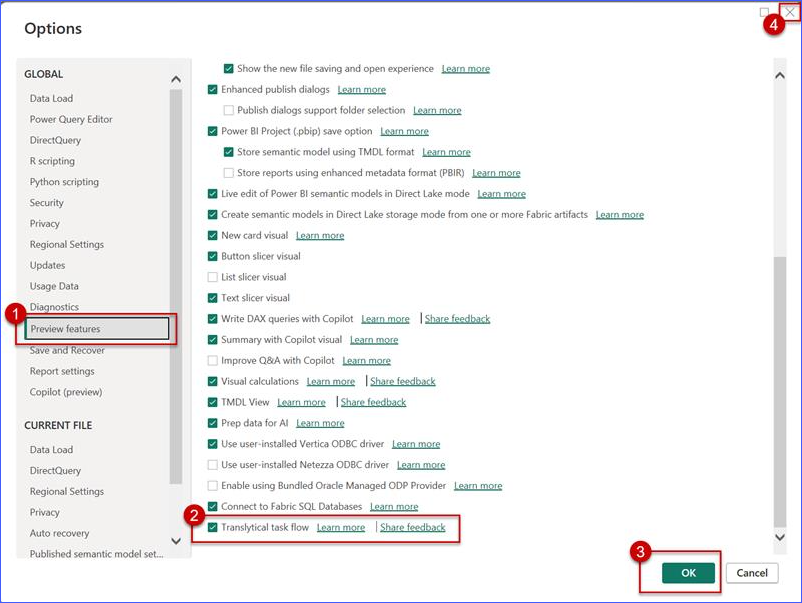

# Pre-Requisites

This workshop covering *SQL database in Microsoft Fabric* requires all attendees to bring their own device and establish an internet connection. 

*Note: All prerequisite activities must be completed prior to class - there will not be time to perform these operations during the workshop.*

## Pre-deployed components for the workshop:
- **PowerBI Account**: *[Power BI Sign in](https://app.powerbi.com/singleSignOn?ru=https%3A%2F%2Fapp.powerbi.com%2F%3FnoSignUpCheck%3D1)*. You will need a PowerBI account with existing Fabric capacity.
- **Enable Microsoft Fabric Tenant Settings**: *[Instructions to enable Microsoft Fabric  for your organizatio](https://learn.microsoft.com/fabric/admin/fabric-switch).*
- **Microsoft Azure Account**: This workshop uses the *[Microsoft Azure](https://ms.portal.azure.com/#home)* platform to host the Azure OpenAI model you will use.
    - You will need to have the **gpt-4-1** and **text-embeddings-ada-002** models deployed.

*Note: You don't have to perform these steps, you will just use it during the workshop. But, if you intend to come back to the workshop on your own time, you'll need to do the steps above.*

## [Action required] Environment configuration by the workshop participants:
- **Git source control repository**: You will need an account and an empty git repository in [GitHub](https://github.com/). If you don't have an account, you can create a free account through [https://github.com/join](https://github.com/join).

- **Enabling Translytical Task Flows in Power BI Desktop**
   - Download and Open Power BI Desktop 
   - If not already installed, download it from the official site: https://powerbi.microsoft.com/desktop/.
   - Launch **Power BI Desktop** once installation is complete.
   - From the top menu bar, click on **File**.

    
    
   - Select **Options and Settings** → **Options**.

    

   - In the Options window, go to **Preview features**.
   - Enable **Translytical task flow** by checking the box.

    

   - Restart Power BI Desktop to apply the changes.

## Optional configuration:
- **VS Code**: Install *[Visual Studio Code](https://code.visualstudio.com/)* and the [SQL Database Projects extension](https://marketplace.visualstudio.com/items?itemName=ms-mssql.sql-database-projects-vscode).

*Note: Only if you want to follow the proctor during the workshop itself or after the workshop to follow through the demos configure components from this section.*

---

Next, continue to [**Introduction and Getting Started**.](../01%20-%20Getting%20Started/01%20-%20Getting%20Started.md)

---

