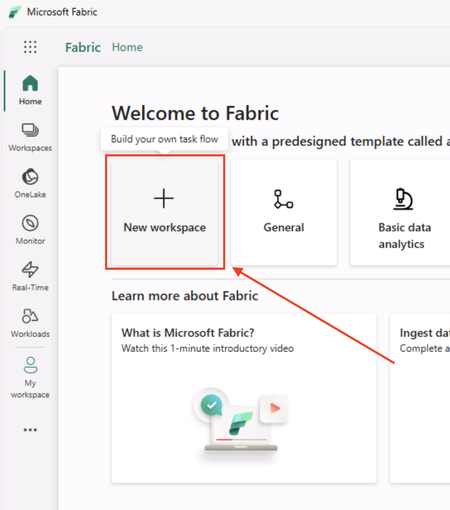
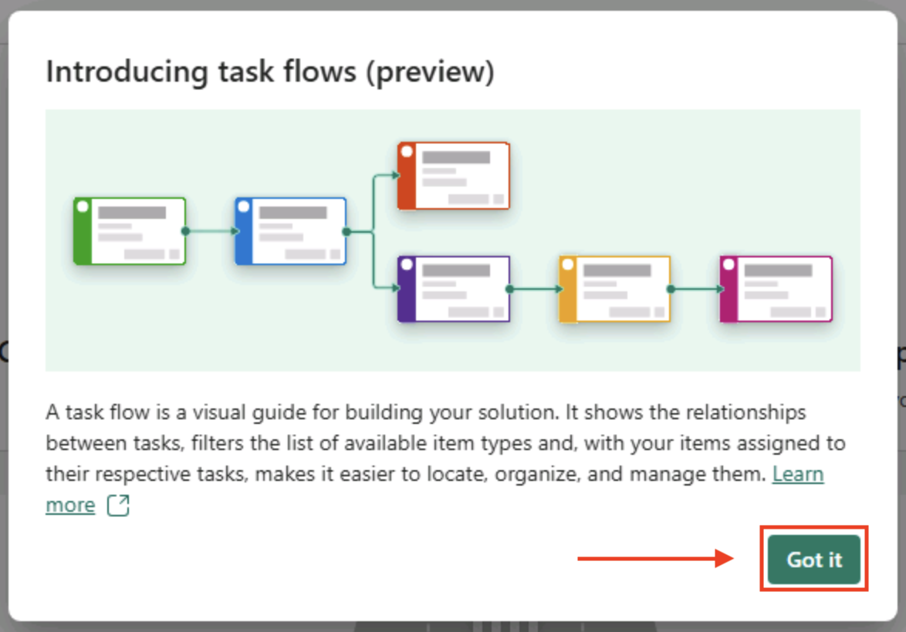
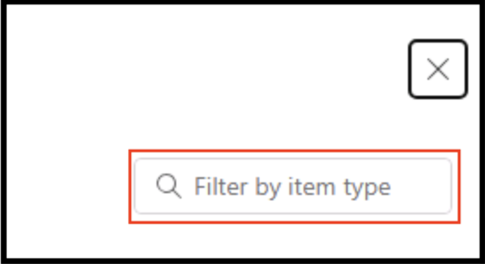
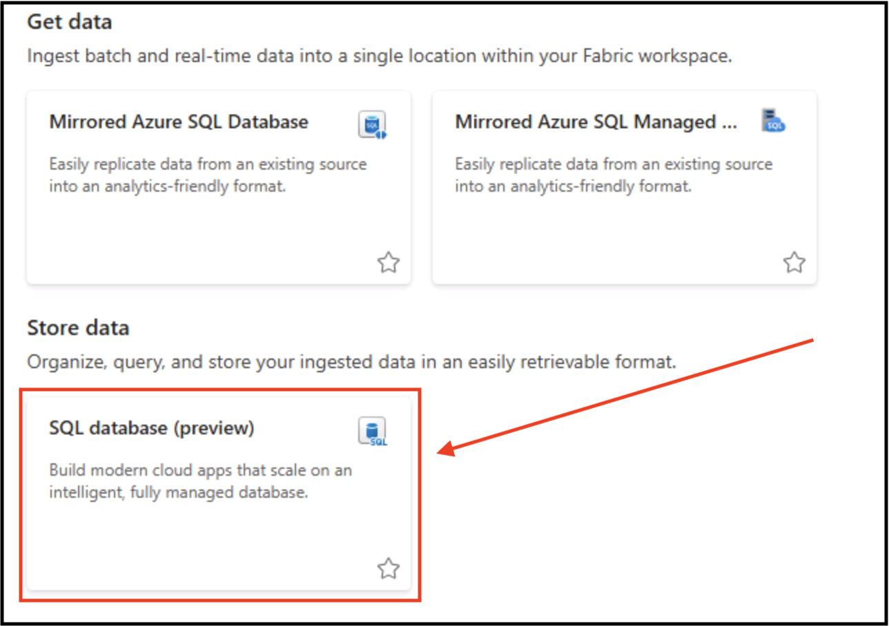

# Introduction to SQL database in Microsoft Fabric

**SQL database** in Microsoft Fabric provides a familiar, fully managed SQL environment within the Fabric ecosystem. It combines the scalability and performance of cloud-native databases with deep integration into Fabric’s analytics and data experiences. Developers, analysts, and business users can all leverage SQL syntax to query, transform, and analyze data alongside other Fabric workloads. It is based on **Azure SQL Database** and uses the same SQL Server engine under the hood.

### Key benefits of using SQL database in Fabric:
- Native integration with Fabric’s end-to-end analytics platform (Data Engineering, Data Science, Power BI)
- Familiar SQL experience, lowering the barrier for anyone with prior SQL Server or T-SQL knowledge.
- Fully managed – no need to handle infrastructure, backups, or scaling.
- Secure and governed by Fabric’s centralized workspace and role-based access control.
- Fast time-to-value – quickly create, load, and query data for analytics and reporting.
- Set up for analytics by automatically replicating the data into OneLake in near real-time - based on the underlying technology of **Mirroring in Fabric**
- Connectable in all the same ways as **Azure SQL Database**, plus a **web-based editor in the Fabric portal**

## Section 1: Getting started

In this section of the workshop, you will be logging into the Microsoft Fabric Portal and creating a new Fabric Workspace.

### Task 1.1: Login 

Using a web browser of your choice, please navigate to this [Microsoft Fabric link](https://app.fabric.microsoft.com/home).

1. Enter your AAD Username e.g. `AIAP.<YourCustomUserName>@fabcon25eu.onmicrosoft.com` in the Email field, then click on the Submit button.
   > **During the workshop, you should have received a printed one-pager from the proctor or speaker. Replace `<YourCustomUserName>` with the value provided on that sheet. Then, enter or copy the AAD user from the page, for example: AIAP.user001@fabcon25eu.onmicrosoft.com**


2. Enter your password and click on the Sign in button. 
> **During the workshop, you should have received a printed one-pager from the proctor or speaker. Please enter or copy the Password from that page.**


3. If prompted with "Stay signed in?" select "Yes" and proceed.

4. If popup "Welcome to the Fabric view" is showed, feel free to close it by selecting 'X' on the top right corner and proceed with the workshop content.


### Task 1.2: Create the Microsoft Fabric Workspace

1. You should be able to find a **New Workspace tile** on the mid-top mid-left side of the screen. Select it to open the **Create a workspace blade** on the right side.

    

2. In the **Create a workspace blade**, 

    
    
    and enter a unique name for the **Workspace Name** field.

   >**Note:** To ensure your workspace name is unique, add the suffix from your username to the workspace name. For example, if your username is ``AIAP.user001@fabcon25eu.onmicrosoft.com``, use ``FabricWorkspaceuser001`` as the workspace name (where ``user001`` is taken from your username).
    
    

3. Select _Advanced_ and scroll down to see the _License mode_ options and selected _Capacity_.
    
    

4. After you scrolled down, make sure that _License mode_ is set to _Fabric capacity_ and that _Capacity_ is selected to your available option.

    

5. Next, click the **green Apply button** on the **bottom left** of the Create a workspace blade.

     

6. On the following page, you may get a popup titled "Introducing task flows (preview)". Click the green **Got it** button.

    

## Section 2: Creating a SQL database in Microsoft Fabric
In this section you will create a SQL database and load it with data.

### Task 2.1: Create the SQL database in Microsoft Fabric

1. On the Microsoft Fabric Workspace page, click the **New item** button on the top right of the page.

   

2. In the **New item** blade on the right, 

    

    use the **Filter by item type search box** in the upper right
    
    
    
    to enter **SQL**

    

3. With the New item results filtered down, click on the **SQL database (preview)** tile.

    

> [!IMPORTANT]
> There may be a few seconds delay after pressing the **SQL database (preview) tile** and when the **New SQL database modal** appears. Just give it a few seconds if it does not appear immediately. 

4. In the **New SQL database** dialog window,

    

5. Use a unique name for the database and after entering the name, click the **green Create button**.

    

6. Once the database is finished creating, 

    

    you will be taken to that SQL database's home page where you can see database objects and issue T-SQL statements right in the web browser.

    

### Task 2.2: Loading the database with sample data

1. You need some sample data in the database to work with. You can easily do this with the **Sample data** tile right on the database home page. Click the **Sample data** tile right on the database home page.

    

2. In the upper right corner of the database home page, you will see a notification indicating that the data is being loaded into the database.

    

    Allow this process to run (about 30-60 seconds) until you see a notification indicating that the data was successfully loaded into the database appearing again, in the upper right corner.
    
    

    While we're waiting for the data to be loaded, feel free to explore SQL database in Fabric portal experience in next minute or so.

    

3. You can open settings database by clicking on cog icon and explore different configurations available here, and also find the connection strings for your app.

    

4. Now click on X in top right corner to close the settings blade and continue observing the ways to insert data and create new T-SQL queries either blank or through templates.

    

5. Next one provides a smooth way to connect directly to your database through the connection wizard from the tool of your choice (SSMS or VSCode) - first click on `Open in` dropdown and then choose the tool. You won't be connecting to the database just yet, so close the settings blade for now by clicking on 'X'.

    

6. Last three options in the toolbar are used for creating new GraphQL API for your Fabric SQL database, opening database performance dashboard in Fabric portal and Copilot on the right side. We'll explore these later during the workshop in more details.

    

7. The sample data has finished loading now and you can observe that by notification in the top right corner and the middle of home page will change show to a **Query, preview, or connect your data** message and image.

    

## Section 3: Working with the SQL database in Microsoft Fabric

In this next section, you will be focused on using the Database Explorer and SQL query blades in Microsoft Fabric

### Task 3.1: Getting familiar with Database Explorer and Query editor

1. To start, look at the **Database Explorer** area on the left of the page. Here, click the dropdown arrow next to the database 

    

    to see a list of database schemas.

    

    and you can further expand the **SalesLT** schema to see object types

    

    as well as objects in the object type folders.

    

2. Expand the **SalesLT** schema, followed by expanding the **Tables** folder. Then click on the **Address** table.

    

3. You can see in the editor window, a read only **Data preview** of the contents of the Address table.

    

4. After browsing the data in the Address table, **close** the Data preview by clicking on the **X** next to the **Address Data preview tab**.

    

5. Now, click the **New Query** button on the tool bar
    
    

    which will open a new query editor window so you can work directly with the database. 

    

6. You can close the gray **Copilot Preview Banner**, click the X on the right side - you'll get back to Copilot later.

    

7. Once the banner is gone, be sure to click in the SQL editor sheet so that the next step will copy the code to the correct location.

    

8. Copy and paste the following code into the query editor:

    ```
    select top 100 * from [SalesLT].[Product]
    ```

9. Once the code is in the query editor, **click the Run button** (or you can use `CTRL + Enter` as a shortcut).

    

    You will see the **results** of the query on the **bottom of the query editor**.

    

    Starting on the left side of the **Results area**, there are 3 options for exporting the data.

    

    From left to right, first is **download results as .xlsx (Excel) file**.

    

    Second option is **download as a .csv file**

    

    And the last option being **download as a .json file**.

    

    And looking on the right side of the results area, you can use the **Copy** button to copy the results in multiple formats.

    

10. Within the Database Explorer you can easily navigate through the queries you have been working with. You can do this by **clicking on the Queries folder in Explorer** on the left side of the screen and choose a particular SQL query.

    

    Also, by **clicking on the 3 dots** next to a query editor sheet name, you can duplicate, rename, delete or share a query. Shared queries a queries visible to all your teammates that have admin, contributor, or member permission in the workspace .

    

### Task 3.2: Mirroring Fabric SQL database to OneLake

Mirroring in Fabric is a low-cost and low-latency solution to bring data from various systems together into a single analytics platform. [Mirroring Fabric SQL database](https://learn.microsoft.com/fabric/database/sql/mirroring-overview) is a feature to continuously replicate data from your operational SQL database in Fabric into the Fabric OneLake. Every SQL database in Microsoft Fabric automatically mirrors its data into Fabric OneLake within the same workspace, with no user action required. Data is being mirrored as soon as it's created or updated. SQL database in Fabric stores its data in .mdf files, just like Azure SQL Database, while mirrored data is stored as Delta files in OneLake.

With the data from your SQL database automatically mirrored in OneLake, you can write cross-database queries, joining data from other SQL databases, mirrored databases, warehouses, and lakehouses. All this is currently possible with using T-SQL queries on the SQL analytics endpoint - a SQL-based experience to analyze OneLake data in Delta tables. Creating a SQL database in Fabric creates a SQL analytics endpoint, which points to the SQL database in Fabric Delta table storage.

1. To access SQL analytics endpoint, you can switch to SQL analytics endpoint mode in SQL database in Database explorer in the top right corner.

    

2. Another way to access SQL analytics endpoint is from the workspace view. Let's open the workspace by selecting a workspace in the menu on the left side.

    

3. You can now observe that there's a SQL analytics endpoint available below your SQL database in Fabric item, like on the image below.

    

4. Let's select a SQL analytics endpoint item to open it, then select a **New SQL query** and execute the following query:
    
    ```
    select top 100 * from [SalesLT].[Product]
    ORDER BY [ProductID] DESC;
    ```

5. Let's now get back to SQL database by choosing a "SQL database" from the top right dropdown.

   

6. In the SQL database query editor select _"New query"_ and execute the following query to insert one record:

    ```
    INSERT INTO [SalesLT].[Product] (
    [Name],
    [ProductNumber],
    [Color],
    [StandardCost],
    [ListPrice],
    [Size],
    [Weight],
    [ProductCategoryID],
    [ProductModelID],
    [SellStartDate],
    [SellEndDate],
    [DiscontinuedDate],
    [ThumbNailPhoto],
    [ThumbnailPhotoFileName],
    [rowguid],
    [ModifiedDate]
    ) VALUES (
    'FabCon Vienna 2025',
    'FAB2025',
    NULL,
    20250915,
    20250915,
    NULL,
    NULL,
    NULL,
    NULL,
    GETDATE(),
    NULL, 
    NULL, 
    NULL, 
    NULL,
    NEWID(),
    GETDATE()
    );
    ```
7. You can monitor the replication status of your database by navigating to the _Replication_ tab on top left corner and selecting _Monitor replication_.

    

8. This will open up a blade on the right side that demonstrates the status and the last mirroring refresh time.

    
    Click 'X' in top right corner of the Fabric Portal (just below your user icon) to close the Replication status blade.

9. Switch back to SQL Analytics endpoint through a dropdown on top right corner

    

10. And now rerun the same query we used before in SQL Analytics endpoint and observe that the first record on top is the one inserted via SQL database.

    
    
    If the new data is not visible yet that means that replication hasn't yet completed. It can take up to a minute or so.

With this, we're wrapping up the hands-on part for this module. 

It's good to know that besides SQL database in Fabric, you can also continuously replicate your existing data estate directly into Fabric's OneLake from a variety of Azure databases and external data sources, such as:
- [Azure SQL Database](https://learn.microsoft.com/fabric/mirroring/azure-sql-database)
- [Azure SQL Managed Instance](https://learn.microsoft.com/fabric/mirroring/azure-sql-managed-instance)
- [Azure Cosmos DB](https://learn.microsoft.com/fabric/mirroring/azure-cosmos-db)
- [Azure Databricks](https://learn.microsoft.com/fabric/mirroring/azure-databricks)
- [PostgreSQL](https://learn.microsoft.com/fabric/mirroring/azure-database-postgresql)
- [Snowflake](https://learn.microsoft.com/fabric/mirroring/snowflake)
- [SQL Server](https://learn.microsoft.com/fabric/mirroring/sql-server)
- [Open mirroring](https://learn.microsoft.com/fabric/mirroring/open-mirroring) - enables *any* application to write directly into a mirrored database in Fabric. 

With SQL analytics endpoint you can join your data from different items using a three-part naming convention. This way you can join data from other mirrored databases or warehouses. 

## What's next
Congratulations! You have learnt the basics of SQL database in Microsoft Fabric. You are now ready to move on to the next exercise:
[Use Copilot with SQL database in Fabric](../03%20-%20Copilot%20capabilities%20for%20SQL%20database%20in%20Microsoft%20Fabric/03%20-%20Copilot%20capabilities%20for%20SQL%20database%20in%20Microsoft%20Fabric.md) to enhance your T-SQL queries and boost your productivity.
