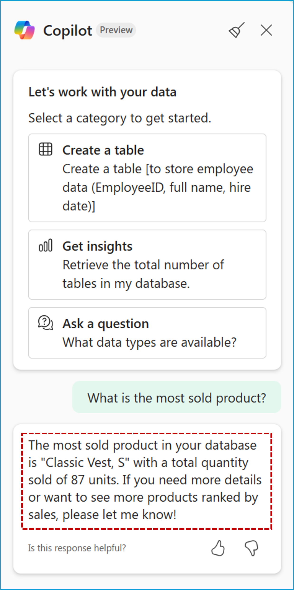

# Copilot capabilities for SQL database in Microsoft Fabric
In this exercise, you will use **Copilot** to assist with T-SQL queries, including **auto-suggestions**, **fixing error**, and **natural language query** to increase developer efficiency and analyze your data!
There're two ways how to utilize Copilot:
- Inline in the query editor
- By opening a Copilot chat

## Section 1: Using Copilot within the query editor
In the **Query Editor** you can use T-SQL comments as a way to write Copilot prompts. After finishing a prompt press **Enter** or **Space** and Copilot will process your request and suggest SQL code to complete your query. 
There're also other capabilities such as **Explain query** and **Fix query errors**. Let's dive in.

### Task 1.1: Using Copilot within the query editor

1. From the left navigation pane select your workspace.

   

2. And now select a SQL database item you've created previously (make sure to click on the artifact name).

   

3. Now, select the **New Query** button on the tool bar as you did in previous module.
    
    

4. Copy a T-SQL script below and press **Enter**. 

   ```
      --Create a query to get the product that is selling the most.
   ```

5. Watch for the loading spinner at the bottom of the editor to track progress, and observe how Copilot’s suggestion appears in the code.

   

   

   > **Note:** Copilot responses may not match what is shown in the screenshot but will provide similar results.

   Optional: If you want to continue following the workshop with the exact same query, feel free to copy it
   ```
   SELECT TOP 1
   [P].[Name],
   SUM([SOD].[OrderQty]) AS TotalSold
   FROM [SalesLT].[SalesOrderDetail] AS SOD
   JOIN [SalesLT].[Product] AS P ON SOD.[ProductID] = P.[ProductID]
   GROUP BY P.[Name]
   ORDER BY TotalSold DESC;
   ``` 

6. Press the **Tab** key on your keyboard to accept the suggestion or continue typing to ignore it.

7. Select the query and click on the **Run** icon (or use keyboard shortcut `Ctrl + Enter` or `Shift + Enter`)

   

### Task 1.2: Copilot Quick Actions within the Query Editor

1. Open a new query and paste the following query with a syntax error and click on the **Run** icon.

   ```
   SELECT c.CustomerID, c.FirstName,c.LastName,
      COUNT(so.SalesOrderID) AS TotalPurchases,
      SUM(so.SubTotal) AS TotalSpent,
      AVG(so.SubTotal) AS AverageOrderValue,
      MAX(so.OrderDate) AS LastPurchaseDate
   FROM
      SalesLT.Customer AS c JOIN SalesLT.SalesOrderHeader AS so ON c.CustomerID = so.CustomerID
   GROUP BY c.CustomerID, c.FName, c.LName ORDER BY TotalSpent DESC;

   ```

2. Observe the query errors (issue) and then select **Fix query errors**.

   

3. Observe the updated query along with the comment that clearly states where the issue was in the query. Now click on **Run** to see the results.

   

  >**Note:** Copilot responses may not match what is shown in the screenshot but will provide similar results.

4. Aside from fixing the query errors, Copilot can also explain a query to you. Select **Explain query** and Copilot will add comments to your query explaining parts of the query.

   

## Section 2: Using Copilot Chat Pane

### Task 2.1: Chat Pane : Natural Language to SQL

1. First open the new query or clear the previous one to have a blank query editor. Next, select the **Copilot** option.

   

2. Click on the **Get started** button.

   

3. Paste the following prompt in the **Copilot** chat box and click on **Send** button.

   ```
   Write me a query that will return the most sold product.
   ```

   

4. Read the answer now and select the **Insert** button to input code into the Query Editor.

   >**Note:** Copilot responses may not match what is shown in the screenshot but will provide similar results.

   

5. Select the query that was inserted by **Copilot**, click on the **Run** icon and check the **Results**. 
   >**Note:** Copilot responses may not match what is shown in the screenshot but will provide similar results.

   

### Task 2.2: Chat Pane: Get results from Copilot

1. Another way to use Copilot is to ask it to get results for you. Open the new query or clear the previous one to have a blank query editor. Paste the following question in the Copilot chat box and click on **Send** button
   ```
   What is the most sold product?
   ```

2. Observe that Copilot has returned the results in the Chat pane.

   >**Note:** Copilot responses may not match what is shown in the screenshot but will provide similar results.

   


### Task 2.3: Chat Pane: Write (with approval)

1. Copilot is also able to write and execute queries on top of your database (with approval). You can choose which type of Copilot you want to use from the dropdown.

   


2. Paste the following question in the **Copilot** chat box and click on **Send** button.
   ```
   Create a view in the SalesLT schema using this query and execute it.
   ```

3. Observe the Copilot's response and select **Run** to execute the given query on top of your database.

   >**Note:** Copilot responses may not match what is shown in the screenshot but will provide similar results.

   

4. Wait a few seconds while Copilot executes the query.

   

9. In the **Explorer** pane on the left, expand the **SalesLT** schema. Open the **Views** folder, then select/click the view you just created. Review the displayed results to validate that the data matches your expectations.

   


## What's next
Congratulations! You have learnt how to leverage **Copilot for SQL database in Microsoft Fabric** to enhance your **query-writing** experience. With these skills, you are now better equipped to write and execute SQL queries faster and troubleshoot errors effectively using Copilot. You are ready to move on to the next exercise: 
[Introduction to GraphQL API builder](../04%20-%20Introduction%20to%20GraphQL%20API%20builder/04%20-%20Introduction%20to%20GraphQL%20API%20builder.md) to enhance your developer's productivity.


