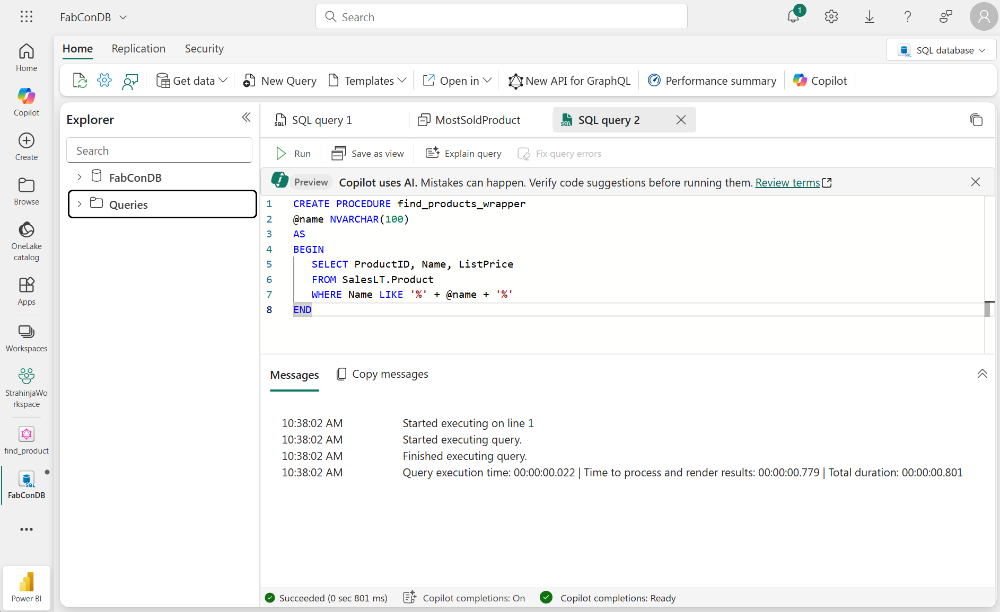
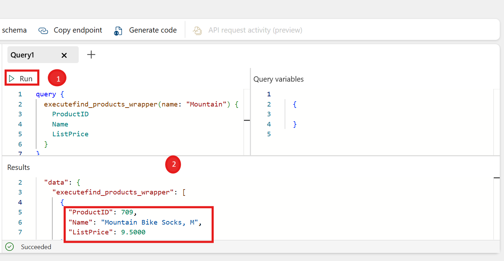

# Introduction to GraphQL API builder

Microsoft Fabric API for GraphQL is a data access layer that lets you query multiple data sources quickly and efficiently using a widely adopted and familiar API technology. The API abstracts the specifics of backend data sources so you focus on your application's logic and provide all the data a client needs in a single call.

## Section 1: Creating a GraphQL API in Fabric SQL

### Task 1.1: Create an API for GraphQL

1. On the Microsoft Fabric Workspace page, click the **New API for GraphQL**.
   
   

2. Enter a **Name** for your item: `find_product`

   
   
   At this point, the API is ready but it's not exposing any data. APIs for GraphQL are defined in a schema organized in terms of types and fields, in a strongly typed system. Fabric automatically generates the necessary GraphQL schema based on the data you choose to expose to GraphQL clients.

3. The Choose data screen allows you to search (1) and choose the objects you want exposed in your GraphQL schema. **Select** the checkbox (2) next to `SalesLT.Product` to choose the object, then, select the product table name (3) to preview the content.
   
   
 
4. Select **Load** (4) to start the GraphQL schema generation process.
   
5. The schema is generated, and you can start prototyping GraphQL queries. The following image shows the Schema explorer with an API call template.
 
   
Your API for GraphQL is now ready to accept connections and requests. You can use the API editor to test and prototype GraphQL queries and the Schema explorer to verify the data types and fields exposed in the API.

### Task 1.2: Run GraphQL Queries

1. Run the default GraphQL query to get first 10 Product based on ProductID. The query below should already be available by default in your GraphQL query editor
   
   ```graphql
   query {
      products(first: 10) {
         items {
            ProductID
         }
      }
   }
   ```

   

2. Copy the below query on to the existing code to return ProductID, ProductNumber, ListPrice
   ```graphql
   query {
      products(first: 10) {
         items {
            ProductID,
            ProductNumber,
            ListPrice
         }
      }
   }
   ```
   

## Section 2: Executing the Stored Procedure in GraphQL

### Task 2.1: Create Stored procedure 

1. Go back to SQL database in Fabric on the left navigation pane.

   

2. Select **New Query** and **Run** the create procedure script from below
   ```sql
   CREATE PROCEDURE find_products_wrapper
   @name NVARCHAR(100)
   AS
   BEGIN
      SELECT ProductID, Name, ListPrice
      FROM SalesLT.Product
      WHERE Name LIKE '%' + @name + '%'
   END
   ```

3. The query should be executed successfully like on the image below. 

   

## Task 2.2 Executing the Stored Procedure in GraphQL

1. Let's now create another GraphQL API by selecting the **New API for GraphQL** as before.
2. Enter a Name for your item **Name** : `find_products_wrapper`
3. In search bar type in `find_products_wrapper` and select the checkbox as you did before.

   

4. Select **Load** to start the GraphQL schema generation process.

5. Go to the **Query** tab and provide the below query text and click run.

   ```graphql
   query {
      executefind_products_wrapper(name: "Mountain") {
         ProductID
         Name
         ListPrice
      }
   }
   ```
   
   

   This will display a list of products that contain **Mountain** in their name.

## What's next
Congratulations! You have learnt basics of how to use GraphQL API in Microsoft Fabric. You're now ready to move on to the next exercise where you'll explore how vector embeddings and Retrieval-Augmented Generation (RAG) can be leveraged to generate intelligent product recommendations:
[RAG Implementation](../05%20-%20RAG%20Implementation%20with%20Azure%20OpenAI/05%20-%20RAG%20Implementation%20with%20Azure%20OpenAI.md).

