# Build an AI Application using RAG with SQL Database in Fabric​

This demo walks through building a Retrieval-Augmented Generation (RAG) application using SQL Database in fabric, and Azure OpenAI. 
You'll learn how to generate and store vector embeddings for relational data, perform semantic similarity searches using SQL's VECTOR_DISTANCE function, and expose the results via a GraphQL API.
The final step integrates Azure OpenAI Chat Completion to deliver natural language responses, enabling intelligent product recommendations. The demo concludes with a Power BI report powered by Copilot for visualizing SQL data.

# Prerequisites

- Fabric Capacity for SQL Database in fabric, Power BI, and Copilot
- An Azure OpenAI Service with the gpt-4 and text-embedding-ada-002 model deployed

# Setup of database credential

A database scoped credential is a record in the database that contains authentication information for connecting to a resource outside the database. For this lab, we will be creating one that contains the api key for connecting to Azure OpenAI services.

> **Note:** During this lab, the OpenAI API key and API name will be provided. If you need assistance accessing these details, please reach out to the proctor. Replace ``<your-api-name>`` with the name of your **Azure OpenAI** service and ``<api-key>`` with the **API key** for the Azure OpenAI API.

Connect to the database and click New SQL Query - Copy the code below and hit run.
```SQL
/*
    Create database credentials to store API key

    Replace <your-api-name> with the name of your Azure OpenAI service and <api-key> with the API key for the Azure OpenAI API
*/
if not exists(select * from sys.symmetric_keys where [name] = '##MS_DatabaseMasterKey##')
begin
    create master key encryption by password = N'V3RYStr0NGP@ssw0rd!';
end
go
if exists(select * from sys.[database_scoped_credentials] where name = 'https://<your-api-name>.openai.azure.com/')
begin
	drop database scoped credential [https://<your-api-name>.openai.azure.com/];
end
create database scoped credential [https://<your-api-name>.openai.azure.com/]
with identity = 'HTTPEndpointHeaders', secret = '{"api-key": "<api-key>"}';
go

 ```
# 1. Creating embeddings for relational data

## Understanding embeddings in Azure OpenAI

An embedding is a special format of data representation that machine learning models and algorithms can easily use. The embedding is an information dense representation of the semantic meaning of a piece of text. Each embedding is a vector of floating-point numbers. Vector embeddings can help with semantic search by capturing the semantic similarity between terms. For example, "cat" and "kitty" have similar meanings, even though they are spelled differently. 

Embeddings created and stored in the Azure SQL Database in Microsoft Fabric during this lab will power a vector similarity search in a chat app you will build.

## The Azure OpenAI embeddings endpoint

1. Using an empty query sheet in Microsoft Fabric, copy and paste the following code. This code calls an Azure OpenAI embeddings endpoint. The result will be a JSON array of vectors.

> **Note:** Replace ``AI_ENDPOINT_SERVERNAME`` with the name of your **Azure OpenAI** service.

```SQL

    declare @url nvarchar(4000) = N'https://AI_ENDPOINT_SERVERNAME.openai.azure.com/openai/deployments/text-embedding-ada-002/embeddings?api-version=2024-06-01';
    declare @message nvarchar(max) = 'Hello World!';
    declare @payload nvarchar(max) = N'{"input": "' + @message + '"}';

    declare @ret int, @response nvarchar(max);

    exec @ret = sp_invoke_external_rest_endpoint 
        @url = @url,
        @method = 'POST',
        @payload = @payload,
        @credential = [https://AI_ENDPOINT_SERVERNAME.openai.azure.com/],
        @timeout = 230,
        @response = @response output;

    select json_query(@response, '$.result.data[0].embedding') as "JSON Vector Array";

```

1. Again, click the run button on the query sheet. The result will be a JSON vector array.

    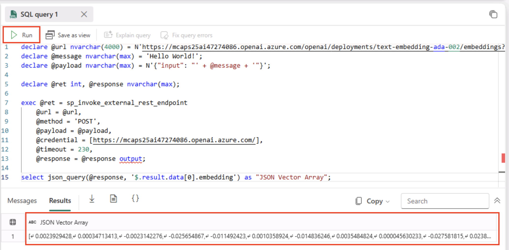

    Using the built in JSON function json_query, we are able to extract JSON array from REST response payloads. In the above T-SQL, **json_query(@response, '$.result.data[0].embedding') as "JSON Vector Array"** will extract the vector array from the result payload returned to us from the Azure OpenAI REST endpoint. 
    
    For reference, the JSON response message from the Azure OpenAI embeddings endpoint will look similar to the following and, you can see how we extract the array found_**$.result.data[0].embedding**.

    > [!TIP]
    >
    > **This code is for reference only** 

    ```JSON-nocopy
    {
        "response": {
            "status": {
                "http": {
                    "code": 200,
                    "description": ""
                }
            },
            "headers": {
                "Date": "Thu, 24 Oct 2024 19:32:59 GMT",
                "Content-Length": "33542",
                "Content-Type": "application/json",
                "access-control-allow-origin": "*",
                "apim-request-id": "ac67032f-41c1-4ec3-acc6-3f697c262764",
                "strict-transport-security": "max-age=31536000; includeSubDomains; preload",
                "x-content-type-options": "nosniff",
                "x-ms-region": "West US",
                "x-request-id": "84baf32d-f1f7-4183-9403-a95365d01a3e",
                "x-ms-client-request-id": "ac67032f-41c1-4ec3-acc6-3f697c262764",
                "x-ratelimit-remaining-requests": "349",
                "azureml-model-session": "d007-20240925154241",
                "x-ratelimit-remaining-tokens": "349994"
            }
        },
        "result": {
            "object": "list",
            "data": [
                {
                    "object": "embedding",
                    "index": 0,
                    "embedding": [
                        0.0023929428,
                        0.00034713413,
                        -0.0023142276,
                        -0.025654867,
                        -0.011492423,
                        0.0010358924,
                        -0.014836246,
                        0.0035484824,
                        0.000045630233,
                        -0.027581815,
                        0.023816079,
                        0.005012586,
                        -0.027732948,
                        -0.010088143,
                        ...
                        -0.014571763
                    ]
                }
            ],
            "model": "text-embedding-ada-002",
            "usage": {
                "prompt_tokens": 3,
                "total_tokens": 3
            }
        }
    }
    ```

    This JSON vector array can now be used with new vector datatype and functions in the SQL database in fabric such as VECTOR_DISTANCE. 

## Preparing the database and creating embeddings

This next section of the lab will have you alter the Adventure Works product table to add a new vector datatype column. You will then use a stored procedure to create embeddings for the products and store the vector arrays in that column.

1. In a new query sheet or an existing bank one in VS Code, copy and paste the following T-SQL:

    ```SQL
    alter table [SalesLT].[Product]
    add  embeddings VECTOR(1536), chunk nvarchar(2000);
    ```

    This code adds a vector datatype column to the Product table. It also adds a column named chunk where we will store the text we send over to the embeddings REST endpoint.

1. Then click the run button on the query sheet

    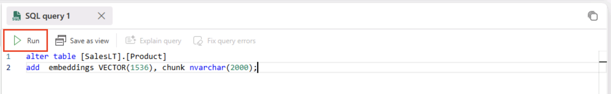

1. Next, you are going to use the External REST Endpoint Invocation procedure (sp_invoke_external_rest_endpoint) to create a stored procedure that will create embeddings for text we supply as an input. Copy and paste the following code into a blank query editor in Microsoft Fabric:

> **Note:** Replace ``AI_ENDPOINT_SERVERNAME`` with the name of your **Azure OpenAI** service.
 
 ```SQL

    create or alter procedure dbo.create_embeddings
    (
        @input_text nvarchar(max),
        @embedding vector(1536) output
    )
    AS
    BEGIN
    declare @url varchar(max) = 'https://AI_ENDPOINT_SERVERNAME.openai.azure.com/openai/deployments/text-embedding-ada-002/embeddings?api-version=2024-06-01';
    declare @payload nvarchar(max) = json_object('input': @input_text);
    declare @response nvarchar(max);
    declare @retval int;

    -- Call to Azure OpenAI to get the embedding of the search text
    begin try
        exec @retval = sp_invoke_external_rest_endpoint
            @url = @url,
            @method = 'POST',
            @credential = [https://AI_ENDPOINT_SERVERNAME.openai.azure.com/],
            @payload = @payload,
            @response = @response output;
    end try
    begin catch
        select 
            'SQL' as error_source, 
            error_number() as error_code,
            error_message() as error_message
        return;
    end catch
    if (@retval != 0) begin
        select 
            'OPENAI' as error_source, 
            json_value(@response, '$.result.error.code') as error_code,
            json_value(@response, '$.result.error.message') as error_message,
            @response as error_response
        return;
    end
    -- Parse the embedding returned by Azure OpenAI
    declare @json_embedding nvarchar(max) = json_query(@response, '$.result.data[0].embedding');

    -- Convert the JSON array to a vector and set return parameter
    set @embedding = CAST(@json_embedding AS VECTOR(1536));
    END;

```

1. Click the run button on the query sheet to create the procedure in the database.

1. You have our embeddings procedure, now use it with data from the various products table. This SQL code takes descriptive elements from each product and concatenating them into a single string to send to the embeddings endpoint. You can construct this text string with the following SQL:

    > [!TIP]
    >
    > **This code is for reference only** 

    ```SQL-nocopy
    SELECT p.Name + ' '+ ISNULL(p.Color,'No Color') + ' '+  c.Name + ' '+  m.Name + ' '+  ISNULL(d.Description,'')
    FROM 
        [SalesLT].[ProductCategory] c,
        [SalesLT].[ProductModel] m,
        [SalesLT].[Product] p
        LEFT OUTER JOIN
        [SalesLT].[vProductAndDescription] d
            on p.ProductID = d.ProductID
            and d.Culture = 'en'
    where p.ProductCategoryID = c.ProductCategoryID
    and p.ProductModelID = m.ProductModelID
    and p.ProductID = @ProductID
    ```
    
    Looking_the SQL, the text we are embedding contains the product name, product color (if available), the category name the product belongs to, the model name of the product, and the description of the product.


1. Run the following T-SQL in a blank query editor in Microsoft Fabric to create embeddings for all products in the Products table:

    > [!IMPORTANT]
    >
    > **This code will take 30 to 60 seconds to run** 

    ```SQL
    SET NOCOUNT ON
    DROP TABLE IF EXISTS #MYTEMP 
    DECLARE @ProductID int
    declare @text nvarchar(max);
    declare @vector vector(1536);
    SELECT * INTO #MYTEMP FROM [SalesLT].Product
    SELECT @ProductID = ProductID FROM #MYTEMP
    SELECT TOP(1) @ProductID = ProductID FROM #MYTEMP
    WHILE @@ROWCOUNT <> 0
    BEGIN
        set @text = (SELECT p.Name + ' '+ ISNULL(p.Color,'No Color') + ' '+  c.Name + ' '+  m.Name + ' '+  ISNULL(d.Description,'')
                        FROM 
                        [SalesLT].[ProductCategory] c,
                        [SalesLT].[ProductModel] m,
                        [SalesLT].[Product] p
                        LEFT OUTER JOIN
                        [SalesLT].[vProductAndDescription] d
                        on p.ProductID = d.ProductID
                        and d.Culture = 'en'
                        where p.ProductCategoryID = c.ProductCategoryID
                        and p.ProductModelID = m.ProductModelID
                        and p.ProductID = @ProductID);
        exec dbo.create_embeddings @text, @vector output;
        update [SalesLT].[Product] set [embeddings] = @vector, [chunk] = @text where ProductID = @ProductID;
        DELETE FROM #MYTEMP WHERE ProductID = @ProductID
        SELECT TOP(1) @ProductID = ProductID FROM #MYTEMP
    END
    ```

1. To ensure all the embeddings were created, run the following code in a blank query editor in Microsoft Fabric: 

    ```SQL
    select count(*) from SalesLT.Product where embeddings is null;
    ```

    You should get 0 for the result.

1. Run the next query in a blank query editor in Microsoft Fabric to see the results of the above update to the Products table:

    ```SQL
    select top 10 chunk, embeddings from SalesLT.Product
    ```

    You can see that the chunk column is the combination of multiple data points about a product and the embeddings column contains the vector arrays.

    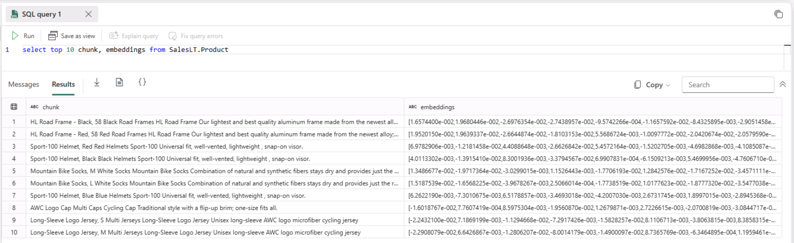

## Vector similarity searching

Vector similarity searching is a technique used to find and retrieve data points that are similar to a given query, based on their vector representations. The similarity between two vectors is usually measured using a distance metric, such as cosine similarity or Euclidean distance. These metrics quantify the similarity between two vectors by calculating the angle between them or the distance between their coordinates in the vector space.

Vector similarity searching has numerous applications, such as recommendation systems, search engines, image and video retrieval, and natural language processing tasks. It allows for efficient and accurate retrieval of similar items, enabling users to find relevant information or discover related items quickly and effectively.

The VECTOR_DISTANCE function is a new feature of the SQL Database in fabric that can calculate the distance between two vectors enabling similarity searching right in the database. 

The syntax is as follows:

```SQL-nocopy
VECTOR_DISTANCE ( distance_metric, vector1, vector2 )
```

You will be using this function in some upcoming samples as well as in the RAG chat application; both utilizing the vectors you just created for the Products table.

1. The first query will pose the question "I am looking for a red bike and I dont want to spend a lot". The key words that should help with our similarity search are red, bike, and dont want to spend a lot. Run the following SQL in a blank query editor in Microsoft Fabric:

    ###### Query 1

    ```SQL
    declare @search_text nvarchar(max) = 'I am looking for a red bike and I dont want to spend a lot'
    declare @search_vector vector(1536)
    exec dbo.create_embeddings @search_text, @search_vector output;
    SELECT TOP(4) 
    p.ProductID, p.Name , p.chunk,
    vector_distance('cosine', @search_vector, p.embeddings) AS distance
    FROM [SalesLT].[Product] p
    ORDER BY distance
    ```

    And you can see from the results, the search found exactly that, an affordable red bike. The distance column shows us how similar it found the results to be using VECTOR_DISTANCE, with a lower score being a better match.

    ###### Query 1 results

    | ProductID | Name | chunk | distance |
    |:---------|:---------|:---------|:---------|
    | 763 | Road-650 Red, 48 | Road-650 Red, 48 Red Road Bikes Road-650 Value-priced bike with many features of our top-of-the-line models. Has the same light, stiff frame, and the quick acceleration we're famous for. | 0.16352240013483477 |
    | 760 | Road-650 Red, 60 | Road-650 Red, 60 Red Road Bikes Road-650 Value-priced bike with many features of our top-of-the-line models. Has the same light, stiff frame, and the quick acceleration we're famous for. | 0.16361482158949225 |
    | 759 | Road-650 Red, 58 | Road-650 Red, 58 Red Road Bikes Road-650 Value-priced bike with many features of our top-of-the-line models. Has the same light, stiff frame, and the quick acceleration we're famous for. | 0.16432339626539993 |
    | 762 | Road-650 Red, 44 | Road-650 Red, 44 Red Road Bikes Road-650 Value-priced bike with many features of our top-of-the-line models. Has the same light, stiff frame, and the quick acceleration we're famous for. | 0.1652894865541471 |

    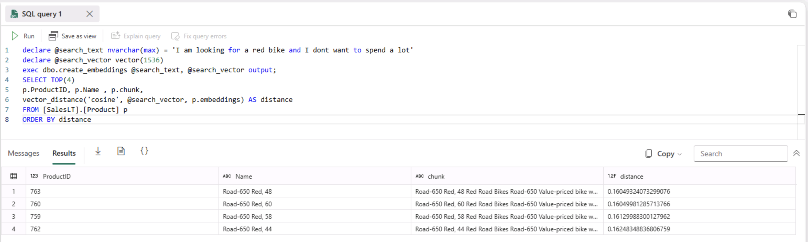

1. The next search will be looking for a safe lightweight helmet. Run the following SQL in a blank query editor in Microsoft Fabric:

    ###### Query 2

    ```SQL
    declare @search_text nvarchar(max) = 'I am looking for a safe helmet that does not weigh much'
    declare @search_vector vector(1536)
    exec dbo.create_embeddings @search_text, @search_vector output;
    SELECT TOP(4) 
    p.ProductID, p.Name , p.chunk,
    vector_distance('cosine', @search_vector, p.embeddings) AS distance
    FROM [SalesLT].[Product] p
    ORDER BY distance
    ```

    With the results returning lightweight helmets. There is one result that is not a helmet but a vest but as you can see, the distance score is higher for this result than the 3 helmet scores.

    ###### Query 2 results

    | Name | chunk | distance |
    |:---------|:---------|:---------|
    | Sport-100 Helmet, Black | Sport-100 Helmet, Black Black Helmets Sport-100 Universal fit, well-vented, lightweight , snap-on visor. | 0.1641856735683479 |
    | Sport-100 Helmet, Red |Sport-100 Helmet, Red Red Helmets Sport-100 Universal fit, well-vented, lightweight , snap-on visor. | 0.16508593401632166 |
    | Sport-100 Helmet, Blue |Sport-100 Helmet, Blue Blue Helmets Sport-100 Universal fit, well-vented, lightweight , snap-on visor. | 0.16592580751312624 |
    | Classic Vest, S | Classic Vest, S Blue Vests Classic Vest Light-weight, wind-resistant, packs to fit into a pocket. | 0.19888204151269384 |


    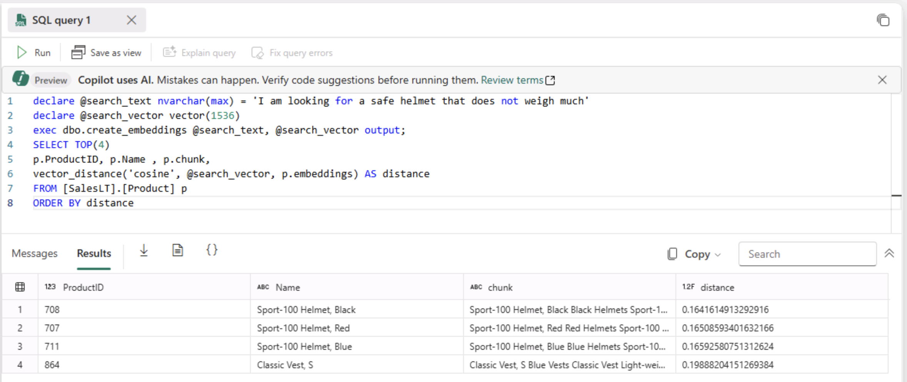

1. In the previous 2 examples, we were clear on what we were looking for; cheap red bike, light helmet. In this next example, you are going to have the search flex its AI muscles a bit by saying we want a bike seat that needs to be good on trails. This will require the search to look for adjacent values that have something in common with trails. Run the following SQL in a blank query editor in Microsoft Fabric to see the results.

    ###### Query 3

    ```SQL
    declare @search_text nvarchar(max) = 'Do you sell any padded seats that are good on trails?'
    declare @search_vector vector(1536)
    exec dbo.create_embeddings @search_text, @search_vector output;
    SELECT TOP(4) 
    p.ProductID, p.Name , p.chunk,
    vector_distance('cosine', @search_vector, p.embeddings) AS distance
    FROM [SalesLT].[Product] p
    ORDER BY distance
    ```

    These results are very interesting for it found products based on word meanings such as absorb shocks and bumps and foam-padded. It was able to make connections to riding conditions on trails and find products that would fit that need.

    ###### Query 3 results

    | Name | chunk | distance |
    |:---------|:---------|:---------|
    | ML Mountain Seat/Saddle | ML Mountain Seat/Saddle No Color Saddles ML Mountain Seat/Saddle 2 Designed to absorb shock. | 0.17265341238606102 |
    | LL Road Seat/Saddle | LL Road Seat/Saddle No Color Saddles LL Road Seat/Saddle 1 Lightweight foam-padded saddle. | 0.17667274723850412 |
    | ML Road Seat/Saddle | ML Road Seat/Saddle No Color Saddles ML Road Seat/Saddle 2 Rubber bumpers absorb bumps. | 0.18802953111711573 |
    | HL Mountain Seat/Saddle | HL Mountain Seat/Saddle No Color Saddles HL Mountain Seat/Saddle 2 Anatomic design for a full-day of riding in comfort. Durable leather. | 0.18931317298732764 |

    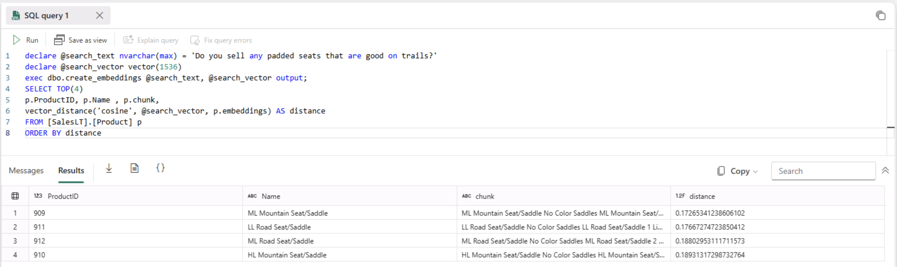

# 2. Creating a GraphQL API for RAG applications

In this section of the lab, you will be deploying a GraphQL API that uses embeddings, vector similarity search, and relational data to return a set of Adventure Works products that could be used by a chat application leveraging a Large Language Model (LLM). In essence, putting all the pieces together in the previous sections.

In the section of the lab, you will create a stored procedure that will be used by the GraphQL API for taking in questions and returning products.

## Creating the stored procedure used by the GraphQL API

1. Run the following SQL in a blank query editor in Microsoft Fabric:

    ```SQL
    create or alter procedure [dbo].[find_products]
    @text nvarchar(max),
    @top int = 10,
    @min_similarity decimal(19,16) = 0.80
    as
    if (@text is null) return;
    declare @retval int, @qv vector(1536);
    exec @retval = dbo.create_embeddings @text, @qv output;
    if (@retval != 0) return;
    with vector_results as (
    SELECT 
            p.Name as product_name,
            ISNULL(p.Color,'No Color') as product_color,
            c.Name as category_name,
            m.Name as model_name,
            d.Description as product_description,
            p.ListPrice as list_price,
            p.weight as product_weight,
            vector_distance('cosine', @qv, p.embeddings) AS distance
    FROM
        [SalesLT].[Product] p,
        [SalesLT].[ProductCategory] c,
        [SalesLT].[ProductModel] m,
        [SalesLT].[vProductAndDescription] d
    where p.ProductID = d.ProductID
    and p.ProductCategoryID = c.ProductCategoryID
    and p.ProductModelID = m.ProductModelID
    and p.ProductID = d.ProductID
    and d.Culture = 'en')
    select TOP(@top) product_name, product_color, category_name, model_name, product_description, list_price, product_weight, distance
    from vector_results
    where (1-distance) > @min_similarity
    order by    
        distance asc;
    GO
    ```

1. Next, you need to encapsulate the stored procedure into a wrapper so that the result set can be utilized by our GraphQL endpoint. Using the WITH RESULT SET syntax allows you to change the names and data types of the returning result set. This is needed in this example because the usage of sp_invoke_external_rest_endpoint and the return output from extended stored procedures 

    Run the following SQL in a blank query editor in Microsoft Fabric:  

    ```SQL
    create or alter procedure [find_products_api]
        @text nvarchar(max)
        as 
        exec find_products @text
        with RESULT SETS
        (    
            (    
                product_name NVARCHAR(200),    
                product_color NVARCHAR(50),    
                category_name NVARCHAR(50),    
                model_name NVARCHAR(50),    
                product_description NVARCHAR(max),    
                list_price INT,    
                product_weight INT,    
                distance float    
            )
        )
    GO
    ```

1. You can test this newly created procedure to see how it will interact with the GraphQL API by running the following SQL in a blank query editor in Microsoft Fabric:

    ```SQL
    exec find_products_api 'I am looking for a red bike'
    ```

    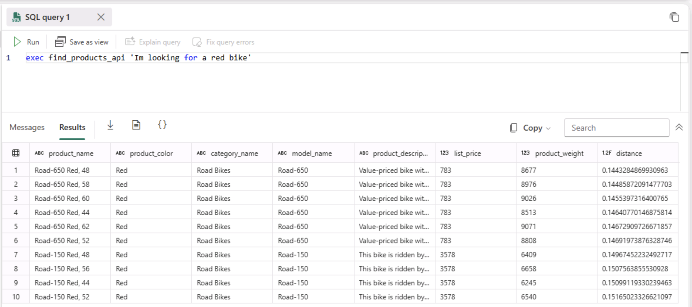

1. To create the GraphQL API, click on the **New API for GraphQL** button on the toolbar.

    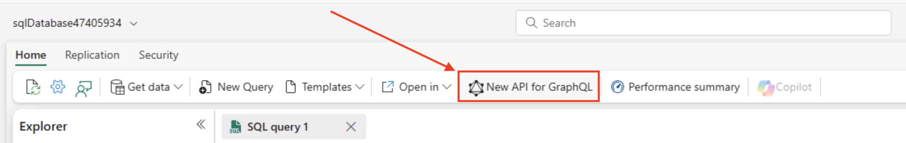

1. In the **New API for GraphQL** dialog box, use the **Name Field** and name the API **find_products_api**.

    +++ find_products_api +++

    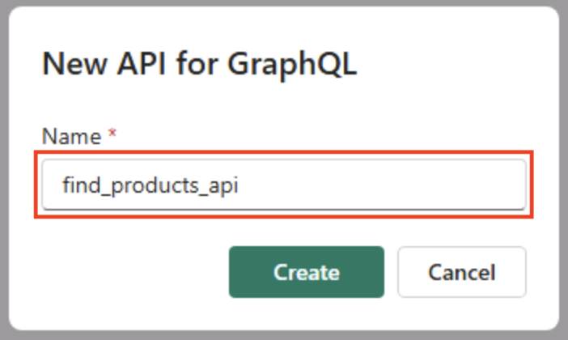

1. After naming the API, click the **green Create button**.

    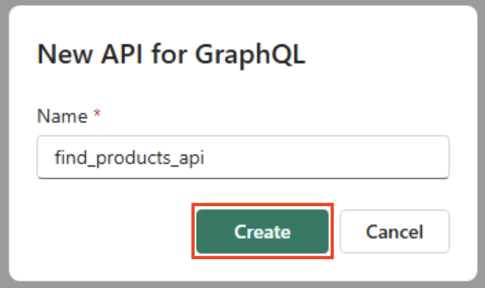

1.  The next dialog box presented is the **Choose data** dialog box where you will pick a table or stored procedure for the GraphQL API, 

    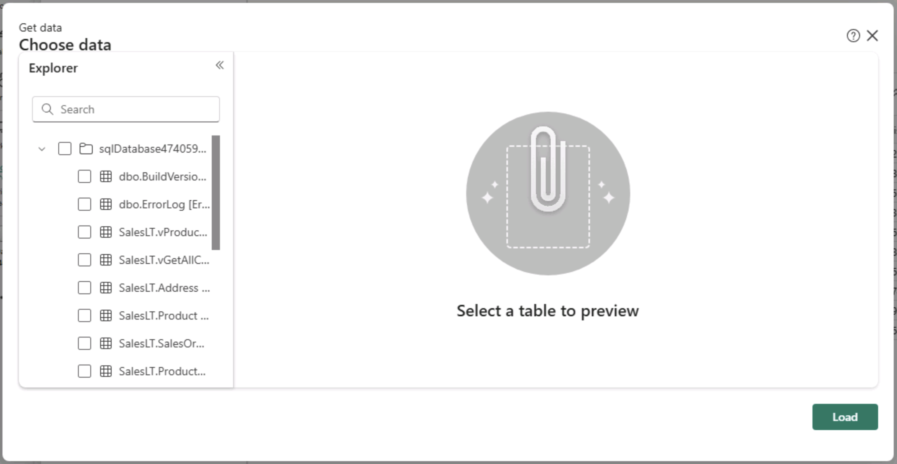

    use the **Search box** in the **Explorer section** on the left 
    
    

    and **enter in find_products_api**.

    +++ find_products_api +++

    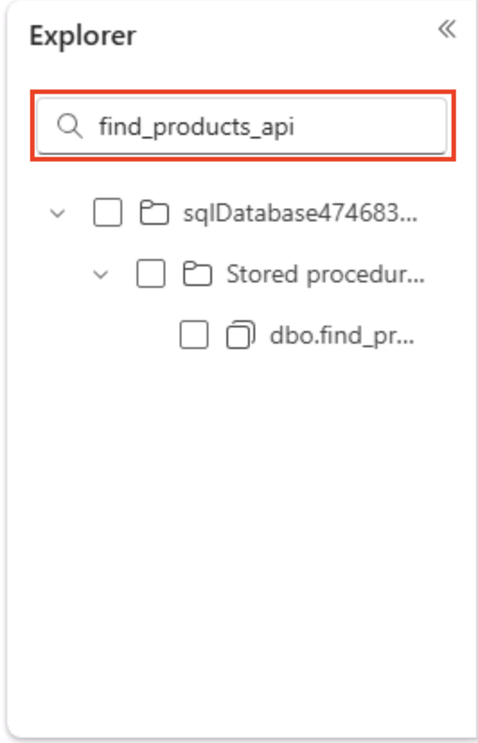

1. Choose the **find_products_api stored procedure in the results**. You can ensure it is the find_products_api stored procedure by hovering over it with your mouse/pointer. It will also indicate the selected database item in the preview section. It should state **"Preview data: dbo.find_products_api"**.

    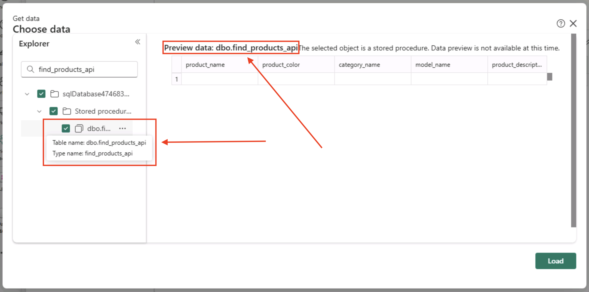

1. Once you have selected the **find_products_api stored procedure**, click the **green Load button** on the bottom right of the modal dialog box.

    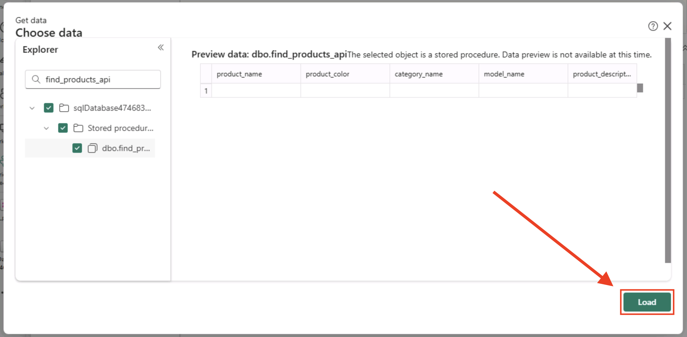

1. You will now be on the **GraphQL Query editor page**. Here, we can run GraphQL queries similar to how we can run T-SQL queries on the query editor.

    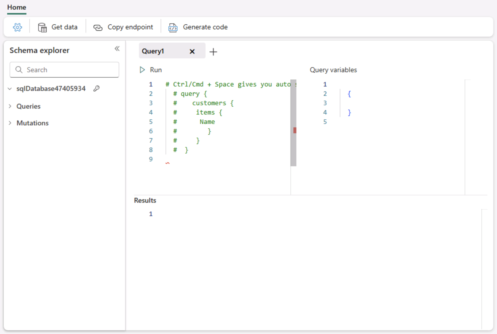

1. Replace the sample code on the left side of the GraphQL query editor with the following query:

    ```graphql
    query {
        executefind_products_api(text: "I am looking for a red bike") {
                product_name
                product_color
                category_name
                model_name
                product_description
                list_price
                product_weight
                distance 
        }
    }
    ```

    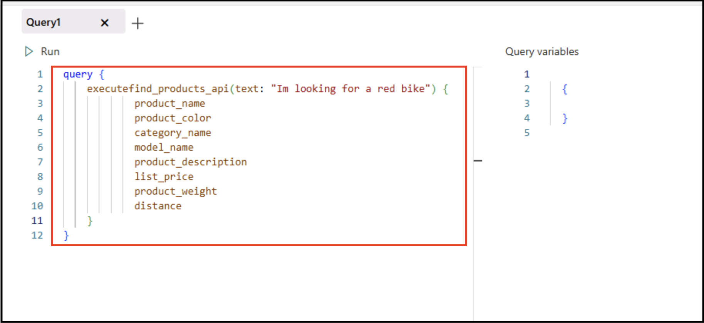

1. Now, click the **Run button** in the upper left of the GraphQL query editor. 

    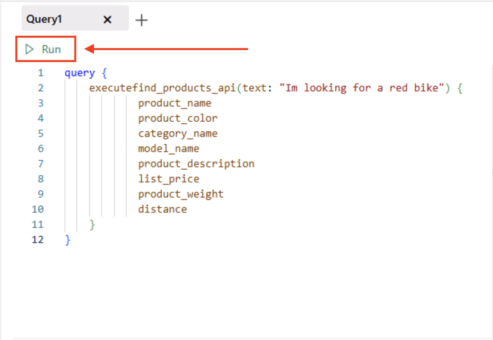

    and you can scroll through the results from the GraphQL query in the lower section of the editor.

    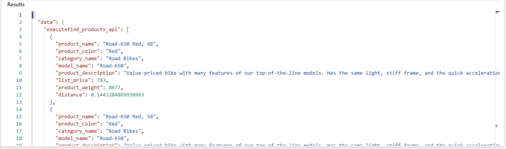

1. Back on the toolbar, find and click the **Generate code button**.

    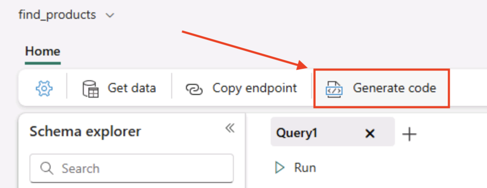

1. This feature will generate the code for calling this API via python or node.js to help give you a jumpstart in the application creation process.

    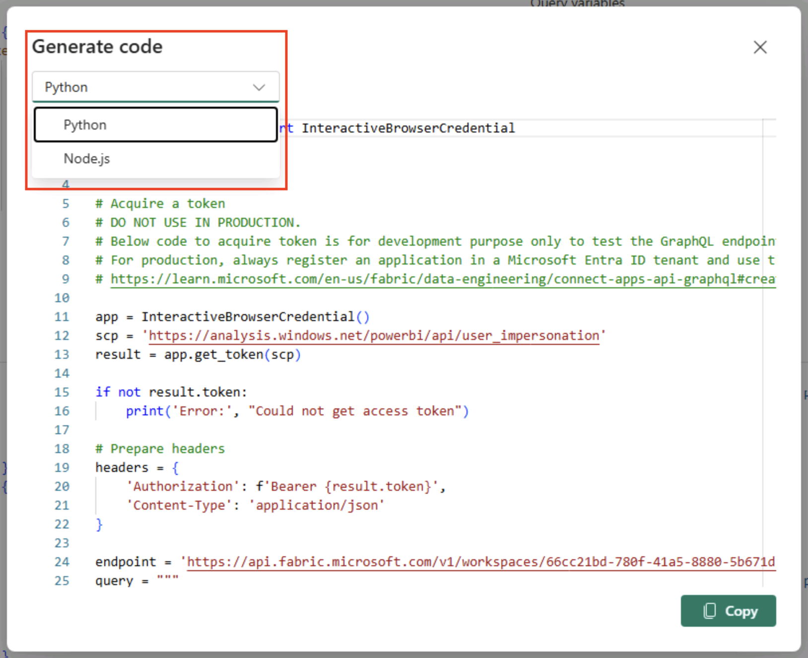

1. When done looking_the python and node.js code, click the **X** in the upper right corner to close the Generate code dialog box.

    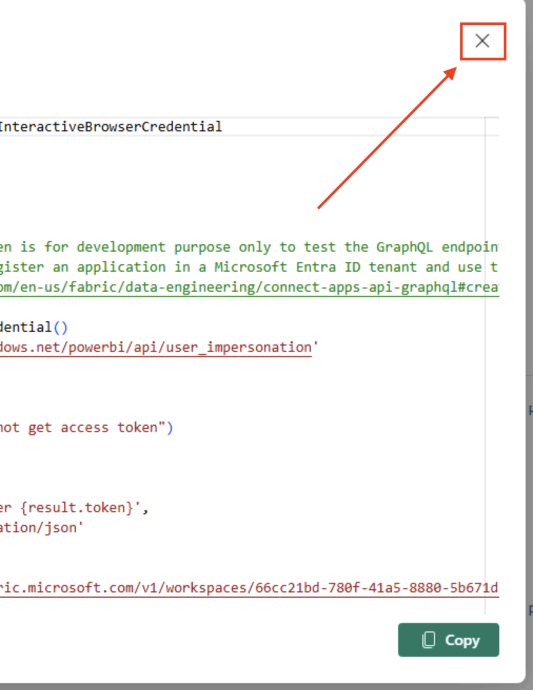

## Adding chat completion to the GraphQL API

The API you just created could now be handed off to an application developer to be included in a RAG application that uses vector similarity search and data from the database. The application may also_some point hand the results off to a LLM to craft a more human response. 

Let's alter the stored procedure to create a new flow that not only uses vector similarity search to get products based on a question asked by a user, but to take the results, pass them to Azure OpenAI Chat Completion, and craft an answer they would typically see with an AI chat application.

1. Before we can start creating new stored procedures, we need to go back to the SQL Database in fabric in fabric home page. Do this by using the navigator on the left side of the page and clicking on the SQL Database icon.

    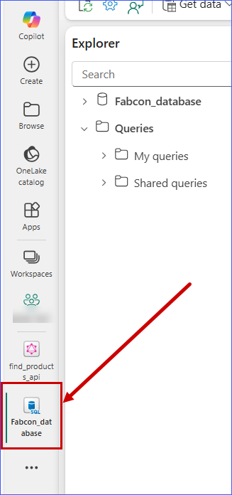

1. The first step in augmenting our RAG application API is to create a stored procedure that takes the retrieved products and passes them in a prompt to an Azure OpenAI Chat Completion REST endpoint. The prompt consists of telling the endpoint who they are, what products they have to work with, and the exact question that was asked by the user. 

    Copy and run the following SQL in a blank query editor in Microsoft Fabric:

> **Note:** Replace ``AI_ENDPOINT_SERVERNAME`` with the name of your **Azure OpenAI** service.


```SQL
    CREATE OR ALTER PROCEDURE [dbo].[prompt_answer]
    @user_question nvarchar(max),
    @products nvarchar(max),
    @answer nvarchar(max) output

    AS

    declare @url nvarchar(4000) = N'https://AI_ENDPOINT_SERVERNAME.openai.azure.com/openai/deployments/gpt-4.1/chat/completions?api-version=2024-06-01';
    declare @payload nvarchar(max) = N'{
        "messages": [
            {
                "role": "system",
                "content": "You are a sales assistant who helps customers find the right products for their question and activities."
            },
            {
                "role": "user",
                "content": "The products available are the following: ' + @products + '"
            },
            {
                "role": "user",
                "content": " ' + @user_question + '"
            }
        ]
    }';

    declare @ret int, @response nvarchar(max);

    exec @ret = sp_invoke_external_rest_endpoint
        @url = @url,
        @method = 'POST', 
        @payload = @payload,
        @credential = [https://AI_ENDPOINT_SERVERNAME.openai.azure.com/],    
        @timeout = 230,
        @response = @response output;

    select json_value(@response, '$.result.choices[0].message.content');

    GO

```

1. Now that you have created the chat completion stored procedure, we need to create a new find_products stored procedure that adds a call to this chat completion endpoint. This new stored procedure contains 2 additional steps that were not found in the original: 
    
    1) A section to help package up the results into something we can use in a prompt.
    
    ```SQL-nocopy
    STRING_AGG (CONVERT(NVARCHAR(max),CONCAT( 
                                    product_name, ' ' ,
                                    product_color, ' ',
                                    category_name, ' ', 
                                    model_name, ' ', 
                                    product_description )), CHAR(13)))   
    ```

    2) A section that calls the new chat completion stored procedure and provides it with the products retrieved from the database to help ground the answer.

    ```SQL-nocopy
    exec [dbo].[prompt_answer] @text, @products_json, @answer output;
    ```

1. Copy and run the following SQL in a blank query editor in Microsoft Fabric:


    ```SQL
    create or alter procedure [dbo].[find_products_chat]
    @text nvarchar(max),
    @top int = 3,
    @min_similarity decimal(19,16) = 0.70
    as
    if (@text is null) return;
    declare @retval int, @qv vector(1536), @products_json nvarchar(max), @answer nvarchar(max);
    exec @retval = dbo.create_embeddings @text, @qv output;
    if (@retval != 0) return;
    with vector_results as (
    SELECT 
            p.Name as product_name,
            ISNULL(p.Color,'No Color') as product_color,
            c.Name as category_name,
            m.Name as model_name,
            d.Description as product_description,
            p.ListPrice as list_price,
            p.weight as product_weight,
            vector_distance('cosine', @qv, p.embeddings) AS distance
    FROM
        [SalesLT].[Product] p,
        [SalesLT].[ProductCategory] c,
        [SalesLT].[ProductModel] m,
        [SalesLT].[vProductAndDescription] d
    where p.ProductID = d.ProductID
    and p.ProductCategoryID = c.ProductCategoryID
    and p.ProductModelID = m.ProductModelID
    and p.ProductID = d.ProductID
    and d.Culture = 'en')
    select
    top(@top)
    @products_json = (STRING_AGG (CONVERT(NVARCHAR(max),CONCAT( 
                                    product_name, ' ' ,
                                    product_color, ' ',
                                    category_name, ' ', 
                                    model_name, ' ', 
                                    product_description, ' ',
                                    list_price, ' ',
                                    product_weight )), CHAR(13)))
    from vector_results
    where (1-distance) > @min_similarity
    group by distance
    order by    
        distance asc;

    set @products_json = (select REPLACE(REPLACE(@products_json, CHAR(13), ' , '), CHAR(10), ' , '));

    exec [dbo].[prompt_answer] @text, @products_json, @answer output;

    GO
    ```

1. The last step before we can create a new GraphQL endpoint is to wrap the new find products stored procedure. Copy and run the following SQL in a blank query editor in Microsoft Fabric:


    ```SQL
    create or alter procedure [find_products_chat_api]
        @text nvarchar(max)
        as 
        exec find_products_chat @text
        with RESULT SETS
        (    
            (    
                answer NVARCHAR(max)
            )
        )
    GO
    ```

1. You can test this new  procedure to see how Azure OpenAI will answer a question with product data by running the following SQL in a blank query editor in Microsoft Fabric:

    ```SQL
    exec find_products_chat_api 'I am looking for a red bike'
    ```

    with the answer being similar to (your answer will be different): **"It sounds like the Road-650 Red, 62 Red Road Bikes Road-650 would be an excellent choice for you. This value-priced bike comes in red and features a light, stiff frame that is known for its quick acceleration. It also incorporates many features from top-of-the-line models. Would you like more details about this bike or help with anything else?"**

    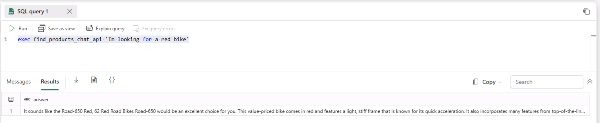

1. To create the GraphQL API, click on the **New API for GraphQL** button on the toolbar just as you did previously.

    

1. In the **New API for GraphQL** dialog box, use the **Name Field** and name the API **find_products_chat_api**.

    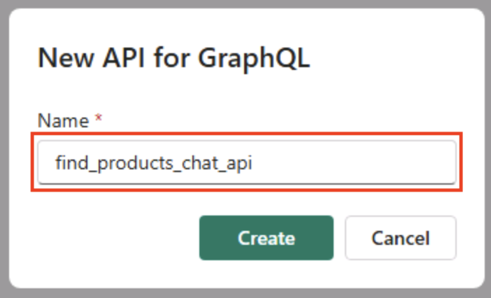

1. After naming the API, click the **green Create button**.

    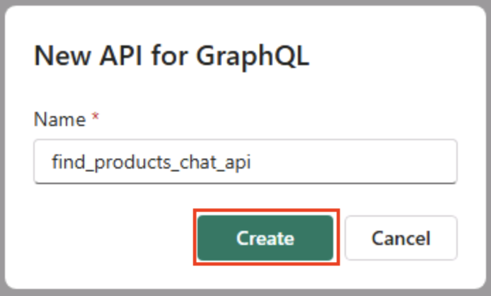

1.  The next dialog box presented is again the **Choose data** dialog box where you will pick a table or stored procedure for the GraphQL API, 

    

    use the **Search box** in the **Explorer section** on the left 
    
    

    and **enter in find_products_chat_api**.

    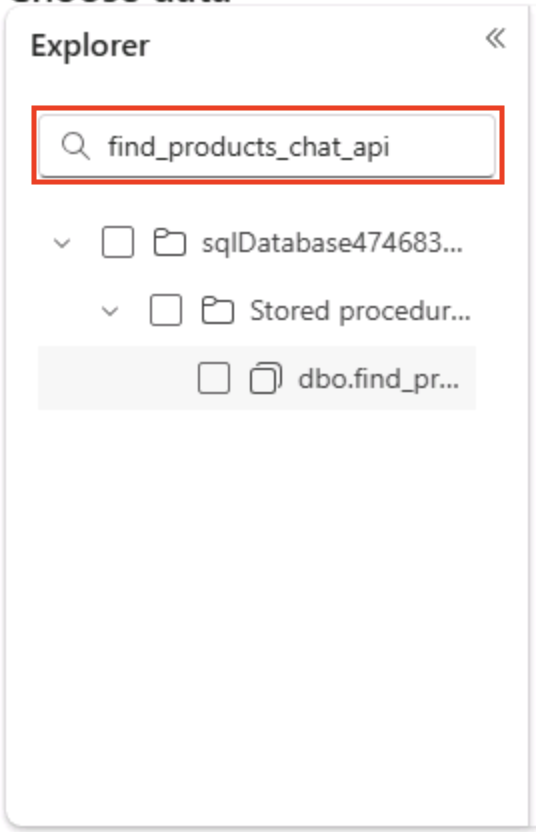

1. Choose the stored procedure in the results. You can ensure it is the **find_products_chat_api stored procedure** by hovering over it with your mouse/pointer. It will also indicate the selected database item in the preview section. It should state **"Preview data: dbo.find_products_chat_api"**.

    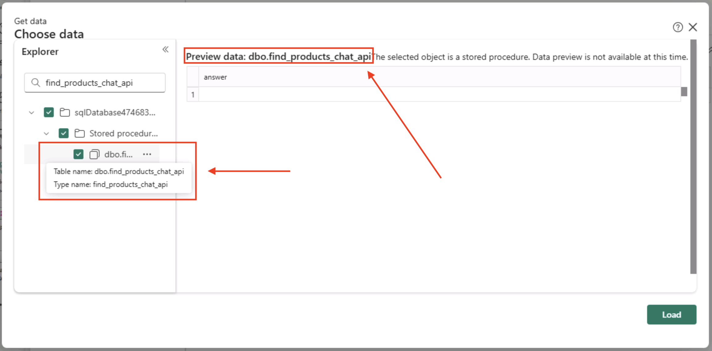

1. Once you have selected the **find_products_chat_api stored procedure**, click the **green Load button** on the bottom right of the modal dialog box.

    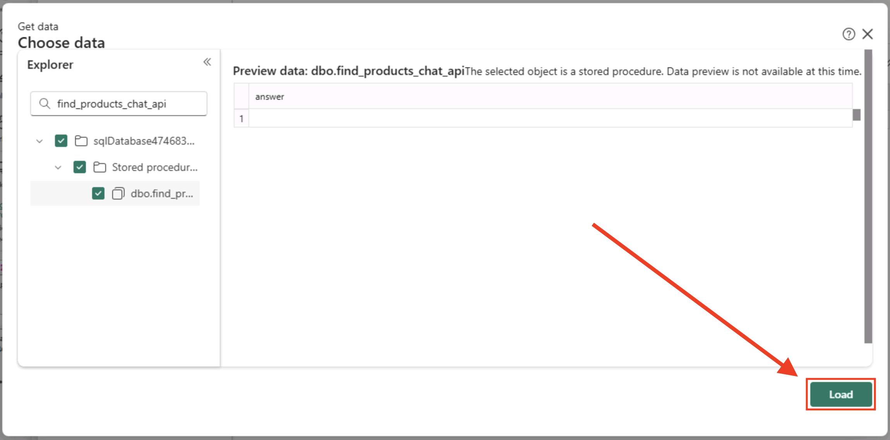

1. You will now be back on the **GraphQL Query editor page**.

    

1. Replace the sample code on the left side of the GraphQL query editor with the following query:

    ```graphql
    query {
        executefind_products_chat_api(text: "I am looking for padded seats that are good on trails") {
                answer
        }
    }
    ```

    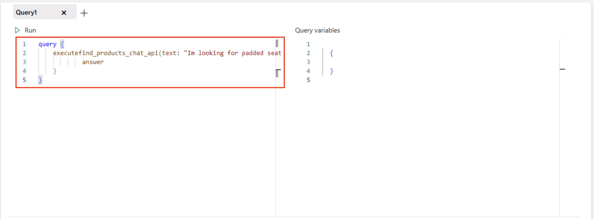

1. Now, **click the Run button** in the upper left of the GraphQL query editor.

    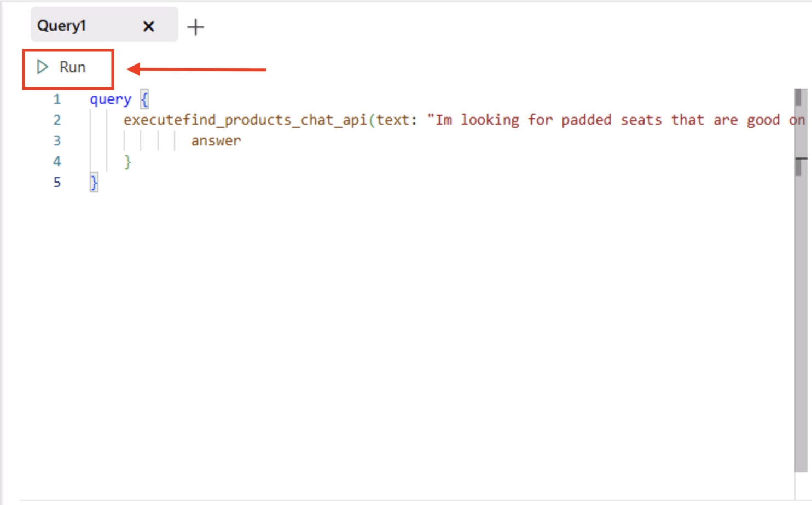    

1. And you can review the response in the **Results** section of the editor

    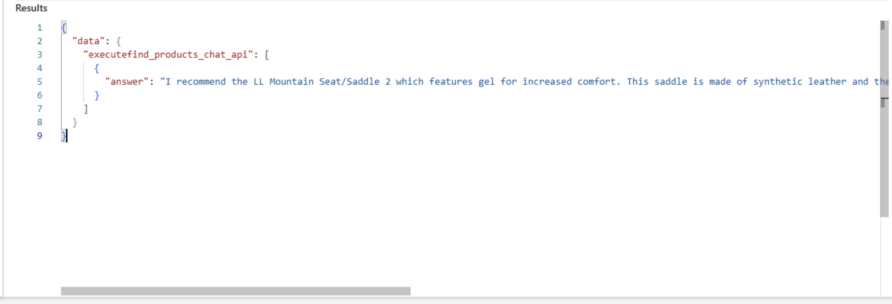

1. Try it again with the following code and see what answer the chat completion endpoint provides!

    ```graphql
    query {
        executefind_products_chat_api(text: "Do you have any racing shorts?") {
                answer
        }
    }
    ```
In this demo, you would have learned how to build a RAG application using SQL database in fabric, and Azure OpenAI. You explored generating vector embeddings for relational data, performing semantic similarity searches with SQL, and integrating natural language responses via GPT-4.1.
