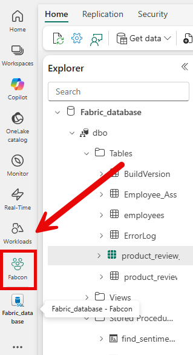
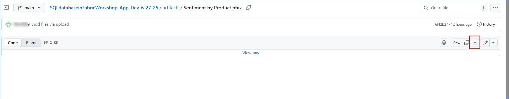
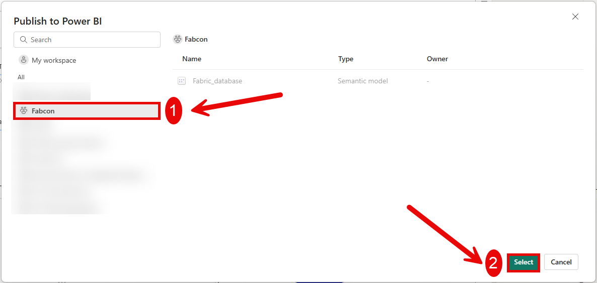
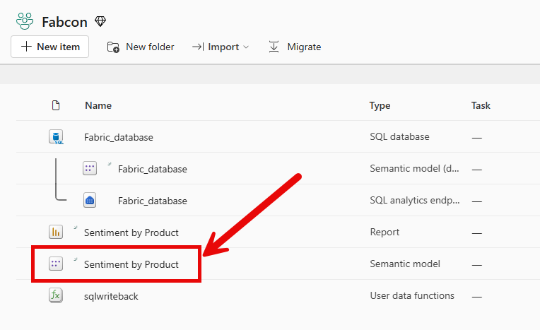
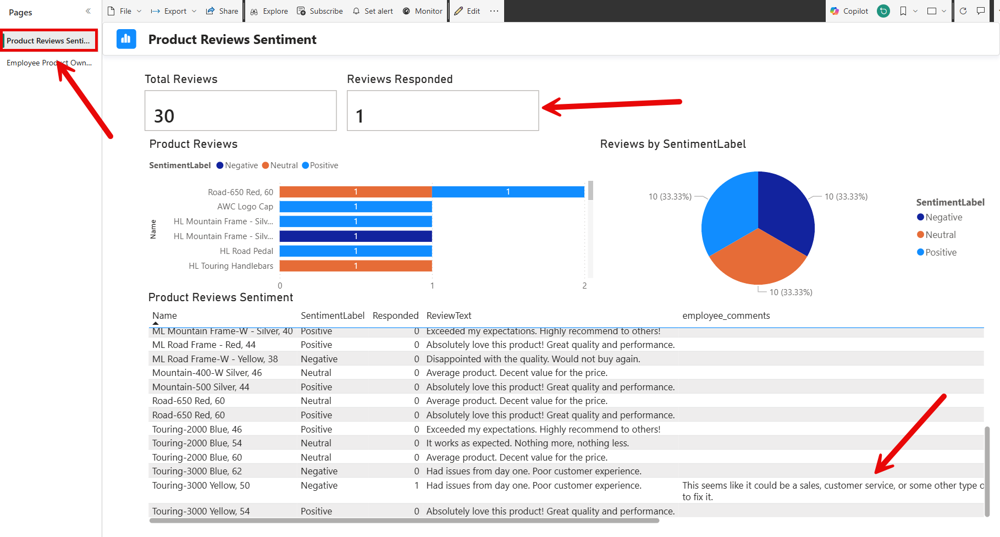

# Sentiment Analysis with Power BI & Translytical Taskflows

In this exercise you will build on the examples from the previous exercise to **score for sentiment** user reviews of products for AdventureWorks.  You will then use Translytical Taskflows to create a **user data function**,**embed it within a Power BI report**, and **respond to the reviews** in order to determine if any actions or follow up is needed by you, the AdventureWorks employee, who owns the product.

# Prerequisites

- Sample Data populated in the Fabric SQL Database
- An Azure OpenAI Service with the gpt-4.1 model deployed
- The Server Name from the Azure OpenAI Service
- The database credential created in Module 5


## Task 7.1: Adding Product Review, Product Owners, and Employees tables.  Populating data and creating stored procedure ins_product_review_feedback

1. Click on **Workspaces** from the left navigation pane and select the **Fabcon** workspace.


2. Search for **database** and select the database created in the previous task.


3. Click on the **New Query** icon.


4. Copy & paste the following query, click on the **Run** icon and then check the output. 

```
SET NOCOUNT ON

-- Step 1: Create the product_reviews table
DROP TABLE IF EXISTS dbo.product_reviews
GO
CREATE TABLE dbo.product_reviews (
    ReviewID INT IDENTITY(1,1) PRIMARY KEY,
    ProductID INT NOT NULL,
    ReviewText NVARCHAR(MAX),
    SentimentLabel VARCHAR(10) null, -- Optional: for validation or training
    CreatedAt DATETIME DEFAULT GETDATE()
);
GO
print('Table dbo.product_reivews created')
GO

-- Step 2: Insert sample reviews for existing products
-- This assumes AdventureWorksLT.Product table exists and has data

-- Positive Reviews
INSERT INTO dbo.product_reviews (ProductID, ReviewText)
SELECT TOP 5 ProductID,
    'Absolutely love this product! Great quality and performance.'
FROM SalesLT.Product
ORDER BY NEWID();

INSERT INTO dbo.product_reviews (ProductID, ReviewText)
SELECT TOP 5 ProductID,
    'Exceeded my expectations. Highly recommend to others!'
FROM SalesLT.Product
ORDER BY NEWID();

-- Neutral Reviews
INSERT INTO dbo.product_reviews (ProductID, ReviewText)
SELECT TOP 5 ProductID,
    'It works as expected. Nothing more, nothing less.'
FROM SalesLT.Product
ORDER BY NEWID();

INSERT INTO dbo.product_reviews (ProductID, ReviewText)
SELECT TOP 5 ProductID,
    'Average product. Decent value for the price.'
FROM SalesLT.Product
ORDER BY NEWID();

-- Negative Reviews
INSERT INTO dbo.product_reviews (ProductID, ReviewText)
SELECT TOP 5 ProductID,
    'Disappointed with the quality. Would not buy again.'
FROM SalesLT.Product
ORDER BY NEWID();

INSERT INTO dbo.product_reviews (ProductID, ReviewText)
SELECT TOP 5 ProductID,
    'Had issues from day one. Poor customer experience.'
FROM SalesLT.Product
ORDER BY NEWID();
GO
print('Table dbo.product_reivews populated with positive, negative, and nuetral reviews')

-- Step 3: Create the product_reviews table
DROP TABLE IF EXISTS dbo.employees
GO
CREATE TABLE dbo.employees(
	employee_ID int identity(1,1) primary key clustered,
    FirstName varchar(100) NULL,
	LastName varchar(100) NULL,
	JobTitle nvarchar(50) NOT NULL
) 
print('Table dbo.employees created')
GO
INSERT dbo.employees (FirstName, LastName, JobTitle) VALUES (N'Syed', N'Abbas', N'Pacific Sales Manager')
GO
INSERT dbo.employees (FirstName, LastName, JobTitle) VALUES (N'Kim', N'Abercrombie', N'Production Technician - WC60')
GO
INSERT dbo.employees (FirstName, LastName, JobTitle) VALUES (N'Hazem', N'Abolrous', N'Quality Assurance Manager')
GO
INSERT dbo.employees (FirstName, LastName, JobTitle) VALUES (N'Pilar', N'Ackerman', N'Shipping and Receiving Supervisor')
GO
INSERT dbo.employees (FirstName, LastName, JobTitle) VALUES (N'Jay', N'Adams', N'Production Technician - WC60')
GO
INSERT dbo.employees (FirstName, LastName, JobTitle) VALUES (N'François', N'Ajenstat', N'Database Administrator')
GO
INSERT dbo.employees (FirstName, LastName, JobTitle) VALUES (N'Amy', N'Alberts', N'European Sales Manager')
GO
INSERT dbo.employees (FirstName, LastName, JobTitle) VALUES (N'Greg', N'Alderson', N'Production Technician - WC45')
GO
INSERT dbo.employees (FirstName, LastName, JobTitle) VALUES (N'Sean', N'Alexander', N'Quality Assurance Technician')
GO
INSERT dbo.employees (FirstName, LastName, JobTitle) VALUES (N'Gary', N'Altman', N'Facilities Manager')
GO
INSERT dbo.employees (FirstName, LastName, JobTitle) VALUES (N'Nancy', N'Anderson', N'Production Technician - WC60')
GO
INSERT dbo.employees (FirstName, LastName, JobTitle) VALUES (N'Pamela', N'Ansman-Wolfe', N'Sales Representative')
GO
INSERT dbo.employees (FirstName, LastName, JobTitle) VALUES (N'Zainal', N'Arifin', N'Document Control Manager')
GO
INSERT dbo.employees (FirstName, LastName, JobTitle) VALUES (N'Dan', N'Bacon', N'Application Specialist')
GO
INSERT dbo.employees (FirstName, LastName, JobTitle) VALUES (N'Bryan', N'Baker', N'Production Technician - WC60')
GO
INSERT dbo.employees (FirstName, LastName, JobTitle) VALUES (N'Mary', N'Baker', N'Production Technician - WC10')
GO
INSERT dbo.employees (FirstName, LastName, JobTitle) VALUES (N'Angela', N'Barbariol', N'Production Technician - WC50')
GO
INSERT dbo.employees (FirstName, LastName, JobTitle) VALUES (N'David', N'Barber', N'Assistant to the Chief Financial Officer')
GO
INSERT dbo.employees (FirstName, LastName, JobTitle) VALUES (N'Paula', N'Barreto de Mattos', N'Human Resources Manager')
GO
INSERT dbo.employees (FirstName, LastName, JobTitle) VALUES (N'Wanida', N'Benshoof', N'Marketing Assistant')
GO
print('Table dbo.employees populated with data')
GO

--4: Create the Employee_Assigned_Products table
IF OBJECT_ID('dbo.Employee_Assigned_Products', 'U') IS NOT NULL
    DROP TABLE dbo.Employee_Assigned_Products;
GO
CREATE TABLE dbo.Employee_Assigned_Products (
    Emp_Assigned_Pdct_ID INT IDENTITY(1,1) PRIMARY KEY CLUSTERED,
    employee_ID INT NOT NULL,
    ProductID INT NOT NULL
);
GO
print('Table dbo.Employee_Assigned_Products created')

--5: Populate the table using a round-robin assignment of employees to products
GO
Declare @SQL NVARCHAR(MAX)

SET @SQL ='WITH EmployeeList AS (
    SELECT employee_ID, ROW_NUMBER() OVER (ORDER BY employee_ID) AS EmpRowNum
    FROM dbo.employees
),
ProductList AS (
    SELECT ProductID, ROW_NUMBER() OVER (ORDER BY ProductID) AS ProdRowNum
    FROM SalesLT.Product
),
Assignment AS (
    SELECT 
        p.ProductID,
        e.employee_ID
    FROM ProductList p
    JOIN EmployeeList e
        ON ((p.ProdRowNum - 1) % (SELECT COUNT(*) FROM EmployeeList)) + 1 = e.EmpRowNum
)
INSERT INTO dbo.Employee_Assigned_Products (employee_ID, ProductID)
SELECT employee_ID, ProductID
FROM Assignment'

exec sp_executesql @SQL
GO
print('Table dbo.Employee_Assigned_Products populated')
GO

--6: Create the product_review_feedback table
DROP TABLE IF EXISTS dbo.product_review_feedback
GO
CREATE TABLE dbo.product_review_feedback (
    ProductID INT NOT NULL,
    ReviewID INT NOT NULL,
    employee_ID INT NOT NULL,
    employee_comments VARCHAR(MAX),
    resolution VARCHAR(MAX),
    created_date DATETIME DEFAULT GETDATE(),
    updated_date DATETIME
);
GO
print('Table dbo.product_review_feedback created')
GO

--7: Create procedure to insert product_review_feedback
CREATE OR ALTER PROCEDURE [dbo].[ins_product_review_feedback]
 @ProductID int,
 @reviewid int,
 @employee_id int
AS
BEGIN
    INSERT INTO dbo.product_review_feedback(ProductID, ReviewID, employee_ID)
    values(@ProductID, @reviewid, @employee_id)
END;

GO
print('Procedure dbo.ins_product_review_feedback created')

--8: Examine the table outputs
SELECT * FROM dbo.product_reviews
SELECT * FROM dbo.employees
SELECT * FROM dbo.Employee_Assigned_Products

```

After the script is run under the dbo schema folder the tables **Employee_Assigned_Products**, **employees**, **product_review_feedback**, and **product_reviews** should be listed.  Under the Stored Procedures folder ins_product_review_feedback should be listed.

> **Note:** Due to the dynamic nature of the script data populated in rows will vary from individual to individual and may not match the screen shot exactly.    


In the results pane Result 1 should list the rows from the **product_reviews** table, Result 2 should list the rows from the **employees table**, and Result 3 should list the results of dbo.**Employee_Assigned_Products**

> **Note:** Due to the dynamic nature of the script data populated in rows will vary from individual to individual and may not match the screen shot exactly.      


5. Copy & paste the following query, **replace** the text and brackets **[AI_ENDPOINT_SERVERNAME]** with the AI Endpoint for Azure OpenAI that you utilized in the previous module.  After the text is replaced click on the **Run** icon and then check the output. 

````
CREATE OR ALTER PROCEDURE [dbo].[find_sentiment_for_product_review]
 @text NVARCHAR(MAX),
 @reviewid int
AS
BEGIN
    -- Check if the search query is NULL, if so, exit the procedure
    IF (@text IS NULL) RETURN;

    DECLARE @RefinedQuery NVARCHAR(MAX);
    DECLARE @LLMResponse NVARCHAR(MAX);
    DECLARE @LLMRetval INT;
    DECLARE @LLMPayload NVARCHAR(MAX);

    -- Prepare the payload for the Language Model API call
    SET @LLMPayload = 
    N'{
        "model": "gpt-4.1",
        "messages": [
            {
                "role": "system",
                "content": "You are an expert at scoring sentiment.  You will examine the product name, product description, and the customer review to determine sentiment.  Remember that the product name and product description can provide context to the review.  You will return one of these values, the review will be Positive, Neutral, or Negative."
            },
            {
                "role": "user",
                "content": "'+@text+'"
            }
        ],
        "max_completion_tokens": 800,
        "temperature": 1.0,
        "top_p": 1.0,
        "frequency_penalty": 0.0,
        "presence_penalty": 0.0,
        "model": "deployment"
    }';

    -- Call the external REST endpoint to interact with the Language Model
    EXEC @LLMRetval = sp_invoke_external_rest_endpoint
         @url = 'https://[AI_ENDPOINT_SERVERNAME].openai.azure.com/openai/deployments/gpt-4.1/chat/completions?api-version=2025-01-01-preview',
         @method = 'POST',
         @credential = [https://[AI_ENDPOINT_SERVERNAME].openai.azure.com/],
         @payload = @LLMPayload,
         @response = @LLMResponse OUTPUT;

    -- Extract the refined query from the LLM response JSON
    SET @RefinedQuery = JSON_VALUE(@LLMResponse, '$.result.choices[0].message.content');

    -- If the refined query is NULL or empty, use the original search query
    IF (@RefinedQuery IS NULL OR LEN(@RefinedQuery) = 0)
        begin
            SET @RefinedQuery = @text;
        end
    
    --Update Product Reviews with the Sentiment Score
    update dbo.product_reviews
    set SentimentLabel = @RefinedQuery
    where
        ReviewID=@reviewid

    --print 'refinedquery: ' + @RefinedQuery


END;


````
6. Validate that the **find_sentiment_for_product_review** stored procedure has been created.


Notice in this stored procedure we are passing through the instructions to the AI Model.

````
"content": "You are an expert at scoring sentiment.  You will examine the product name, product description, and the customer review to determine sentiment.  Remember that the product name and product description can provide context to the review.  You will return one of these values, the review will be Positive, Neutral, or Negative."
````

The Product Description and the Product name could add context to a customer review.  For example, if the product were a lightweight bike and the customer review said "It was heavier than I expected", this could indicate Negative sentiment.  However, without the context of the product name and description it may come through as Nuetral sentiment.

## Task 7.2: Score existing customer reviews

1. Click on the **New Query** icon.


2. Copy & paste the following query, click on the **Run** icon and then check the output. 


````
-- Declare a cursor to iterate over product names and descriptions
Declare @text Nvarchar(max),@productid int, @reviewid int, @productName VARCHAR(500), @productDescription VARCHAR(MAX), @productReview VARCHAR(MAX), @employee_id int

DECLARE ReviewCursor CURSOR FOR
SELECT 
    pr.ReviewID
    ,p.ProductID
    ,p.Name
    ,pd.Description
    ,pr.ReviewText
    ,eap.employee_ID
FROM dbo.product_reviews pr
LEFT JOIN SalesLT.Product p ON pr.ProductID = p.ProductID
LEFT JOIN SalesLT.ProductModel pm ON p.ProductModelID = pm.ProductModelID
LEFT JOIN SalesLT.ProductModelProductDescription pmpd ON pm.ProductModelID = pmpd.ProductModelID
LEFT JOIN SalesLT.ProductDescription pd ON pmpd.ProductDescriptionID = pd.ProductDescriptionID
LEFT JOIN dbo.Employee_Assigned_Products eap ON pr.ProductID = eap.ProductID
WHERE pr.SentimentLabel IS NULL
  AND pmpd.Culture = 'en';

OPEN ReviewCursor;

FETCH NEXT FROM ReviewCursor INTO @reviewid, @productid, @productName, @productDescription,@productReview, @employee_id;

WHILE @@FETCH_STATUS = 0
BEGIN
    SET @productDescription = REPLACE(@productDescription, '"', '\"')


     -- set text value for sentiment analysis
     set @text= 'Product Name: '+'''' + @productName + '''' + ' Product Description: ' + '''' + @productDescription + '''' + ' Customer review: ' + '''' + @productReview + ''''
    
    -- execute procedure to call model and score sentiment
     EXEC dbo.find_sentiment_for_product_review @text, @reviewid

     --execute procedure to create product_review_feedback entry
     EXEC dbo.ins_product_review_feedback @productid, @reviewid, @employee_id 

      

    -- Fetch the next row
    FETCH NEXT FROM ReviewCursor INTO @reviewid, @productid, @productName, @productDescription,@productReview, @employee_id;
END;

CLOSE ReviewCursor;
DEALLOCATE ReviewCursor;

````


After running this query the seniment column in the product_reviews table should no longer be null.  It should be scored with a sentiment by the model.

3. Click on the product_reviews table to validate the seniment data has been scored.

> **Note:** Due to the dynamic nature of the script data populated in rows will vary from individual to individual and may not match the screen shot exactly.    


4. Click on the product_review_feedback table to validate that is has been populated with data.  The employee_comments column should currently be NULL.

> **Note:** Due to the dynamic nature of the script data populated in rows will vary from individual to individual and may not match the screen shot exactly.    


## Task 7.3: Create User Data Function sqlwriteback

1. Return to the main **Fabcon Workspace**.




2. Click **+ New item**, in the search box type **"User"**, and select **User data functions (preview)**.


3. Name the User data function **"sqlwriteback"**.


4. Click **New Function**.


5. Click **Manage connections** | **+Add connection**.


6. Click **Fabric_database** | click **Connect**.


Once the connection is established, the interface will appear as shown in the screenshot below. 

7. Copy the **Alias**, we will use that in a moment. Click the **Close** button.


9. Copy and paste the following code into the Function explorer window, replace the brackets and text in **[Put Alias Here]** with the Alias we copied in **step 7**.


````
import fabric.functions as fn

udf = fn.UserDataFunctions()

@udf.connection(argName="sqlDB",alias="[Put Alias Here]") 
@udf.function() 


def write_emp_info_on_product_Review(sqlDB: fn.FabricSqlConnection, productid: int, ReviewID: int, EmployeeID: int, employeeComments: str) -> str:

    # Error handling to ensure product description doesn't go above 200 characters
    if(len(employeeComments) > 20000):
        raise fn.UserThrownError("Comments have a 20000 character limit. Please shorten your description.", {"Comments:": employeeComments})

    # Establish a connection to the SQL database  
    connection = sqlDB.connect() 
    cursor = connection.cursor() 

    # Insert data into the ProductDescription table
    insert_description_query = "UPDATE dbo.product_review_feedback set employee_comments =?, updated_date=getdate() where ProductID=? and ReviewID=? and employee_ID=?"   
    cursor.execute(insert_description_query, (employeeComments, productid, ReviewID, EmployeeID)) 


    # Commit the transaction 
    connection.commit() 
    cursor.close() 
    connection.close()  

    return "Employee has inserted comments"

````


8. Click **Publish**, it will take a moment for the User data function to publish, wait until you recieve the following notification **sqlwriteback has been published successfully.**

> **Note:** Publishing the User data function may take a few minutes.  If it fails, attempt to Publish again.   


## Task 7.4: Download and Configure Power BI Report in Power BI Desktop

1. **Right Click** and **open in another tab**; this link, [Sentiment by Product](../../artifacts/Sentiment%20by%20Product.pbix), to download the Power BI Report from the GitHub repository.



2. Open the Report from your Downloads folder and Sign into Power BI Desktop with the account you are using for the class.

> **Note:** If you get a prompt that data is being refreshed hit cancel.  If you do not hit cancel and it prompts you to log in, hit cancel, then hit cancel again.  Basically hit cancel until you can proceed with step 3 where we load the Server Name and Database Name parameters.      


3. Under **Home** click on **Transform data** dropdown,click on **Edit parameters**.


4. In your **Fabric Workspace** go to your **Fabcon_database** | Under **Home** click on Open in | Select **SQL Server Management Studio**.


5. This will open a dialogue window | Copy the **Server Name** and the **Database Name** | Save it some where you can reuse it.


6. Back in Power BI Desktop **paste** the **Server Name** in the **Server Name** parameter and the **Database Name** in the **Database Name** parameter and **Click** OK.  


7. You may be promted to log into your Fabric Workspace using the credenitals that have been provided for this lab.  


> **Note:** If you see a message that says "There are pending changes in your queries that haven't been applies", **click** Apply Changes. 


8. **Click** on the **Employee Product Ownership** report Tab.

9. **Right click** on the Submit button and **click** Format.


10. Under Format button expand the tree by Action.


11. Under **Type** select **Data Function** | Under **Workspace** click **Fabcon**.


12. Under **Function Set** select the name of the User data function we created **sqlwriteback**.


13. Under **Data function** select **write_emp_info_on_product_review**.


14. Select the **fx** button next to **productid**.


15. Under **What field should we base this on?**  Select **All data** | Select the **Products** table | Select **ProductID** | Under Summarization select **Maximum** | Click **OK**.


16. Repeat these steps for **ReviewID** Selecting the **Product Reviews** table under **All data**.


17. Repeat these steps for **EmployeeID** Selecting the **Employees** table under **All data** and the **employee_ID** column.


18. Select the drop down for **employeeComments** and select **Internal Product Owner Comments**. 


19. Click on **Home** | Click **Publish**.


20. Click on your **Fabcon workspace** | Click **Select**.



21. Click **Got it**.


22. You may close Power BI Desktop now.


## Task 7.5: Upload Power BI Report and configure DirectQuery connections


1. Click on **Workspaces** from the left navigation pane and select the **Fabcon** workspace.


2. Click on the **Sentiment by Product** Semantic model.




3. Click on  **File** | **Settings**.


4. You will see an error that says **"Failed to test the connection to your data source.  Please retry your credentials."** |  Click **Edit credentials**.


5. Select **OAuth2** for **Authentication Method** | Select **None** for **Privacy level setting for this dat asource** | **Check** Report viewers can access this data sourde with their own Power BI identities in  DirectQuery or DirectLake mode | Click **Sign in**.


6. Click on **Workspaces** from the left navigation pane and select the **Fabcon** workspace.


7. Click on the Sentiment by Product report and validate that it loads correctly.


## Task 7.6: Find negative customer reviews and leave internal employee feedback

1. Click on your Fabric_database

2. Click on the **New Query** icon.


3. Copy and Paste the following query text and run it.

```
SELECT 
    e.FirstName
    ,e.LastName
    ,pr.ReviewID
    ,pr.SentimentLabel
    ,p.ProductID
    ,p.Name
    ,pd.Description
    ,pr.ReviewText
    ,eap.employee_ID
FROM dbo.product_reviews pr
LEFT JOIN SalesLT.Product p ON pr.ProductID = p.ProductID
LEFT JOIN SalesLT.ProductModel pm ON p.ProductModelID = pm.ProductModelID
LEFT JOIN SalesLT.ProductModelProductDescription pmpd ON pm.ProductModelID = pmpd.ProductModelID
LEFT JOIN SalesLT.ProductDescription pd ON pmpd.ProductDescriptionID = pd.ProductDescriptionID
LEFT JOIN dbo.Employee_Assigned_Products eap ON pr.ProductID = eap.ProductID
LEFT JOIN dbo.employees e on eap.employee_ID = e.employee_ID
WHERE  pmpd.Culture = 'en'
and pr.SentimentLabel='Negative'
and pr.ReviewText='Had issues from day one. Poor customer experience.';

```


4. Select an Employee **First Name** and **Last Name** to use in the **Sentiment by Product report**.  For example in the picture FirstName David and LastName Barber is selected.  If David Barber is not the first name in your list, select the FirstName and LastName of the individual listed in the results of your query.

> **Note:** Due to the dynamic nature of the script data populated in rows will vary from individual to individual and may not match the screen shot exactly.      


5. Click on the **Sentiment by Product** report on the left menu.


6. Click on the **Employee Product Ownership** tab | In the **filters** at the top select the employee **First Name** and **Last Name** from your **SQL query results** | Select one of the **products** from the **Products Owned by Employee** table that has the review that starts with **"Had issues from day one"**.

> **Note:** Due to the dynamic nature of the script data populated in rows will vary from individual to individual and may not match the screen shot exactly.      


> **Note:** It is very important to select a line from the **Products Owned by Employee** table.  When you configured the action on our button you set all the fields to Maximum.  This captures the **Maximum** value selected on the page.  
You are selecting the **Maximum** values on the page by selecting one line on the Products Owned by Employee table.


7. Click on the text area titled **Internal Product Owner Comments**.  Enter a comment refering to the review for example: "This seems like it could be a sales, customer service, or some other type of issue.  We should loop in other managers and follow up with the customer to see where the problem is and what we can do to fix it." Click **Submit**.


This will call our User data function and will enter our text into the dbo.product_review_feedback table.

9. You should see that the **Responded** title card now has **1 entry**, and the text we entered is not visible on the screen under the employee_comments table. 

> **Note:** Due to the dynamic nature of the script data populated in rows will vary from individual to individual and may not match the screen shot exactly.    


10. Click on the **Product Reviews Sentiment** tab | You will see **Reviews Responded** has incrmented and the Employee comments are now visible in the **Product Reviews Sentiment** table.

> **Note:** Due to the dynamic nature of the script data populated in rows will vary from individual to individual and may not match the screen shot exactly.    



Congratulations! You have learned how to leverage **Sentiment Analysis with Power BI and Translytical Taskflows**. You are ready to move on to the next exercise: [Exercise 7: Continuous integration and deployments in Fabric](../08%20-%20ALM%20-%20Github%20Source%20Control/08%20-%20ALM%20-%20Github%20Source%20Control.md)


