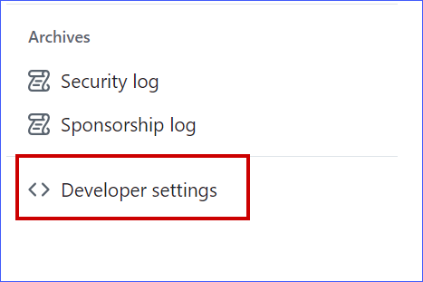
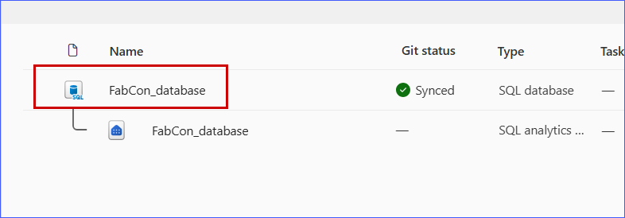

# Continuous integration and deployments in Fabric

In this section of the workshop, you will learn about managing the lifecycle of your application using source control. The Microsoft Fabric application lifecycle management (ALM) capabilities enable you to implement continuous integration and continuous deployment (CI/CD) practices for your SQL database as part of a wholistic data and DevOps strategy. The Fabric lifecycle management source control and deployment pipelines extend to additional item types (such as PowerBI reports and notebooks) and provide a more integrated experience for managing the lifecycle of Fabric items. For SQL database in Fabric, the source control integration is based on SQL database projects, so development processes created for SQL Server/Azure SQL Database can often be reused with SQL database in Fabric.

You'll cover these topics in this module:

- [Connecting a workspace to source control](#activity-connecting-a-workspace-to-source-control)
- [Commit changes to source control](#activity-commit-changes-from-your-database-to-source-control)

The [git integration admin settings](https://learn.microsoft.com/fabric/admin/git-integration-admin-settings#users-can-synchronize-workspace-items-with-their-git-repositories) in your environment may impact which source control provider you are able to use when completing this exercise. We will use the GitHub integration for Fabric in the detailed steps of this exercise, which allows you to connect a Fabric workspace to a GitHub repository.

## Initial setup

### GitHub repositories

To use the **GitHub** source control integration, your Fabric administrators must [enable GitHub integration](https://learn.microsoft.com/fabric/admin/git-integration-admin-settings#users-can-sync-workspace-items-with-github-repositories) in the Fabric admin settings and you must create a personal access token (PAT) from you GitHub account.

1. In GitHub, create a fine-grained [access token](https://github.com/settings/personal-access-tokens/new) with read and write access to your workshop repository. These are created in GitHub user **profile settings** under **Developer settings**. 

2. Log into **Github** and click on the **Profile** Icon and select **Settings**.


3. Scroll down the page and click on **Developer settings**.



4. Click **Fine-grained tokens** under **Personal access tokens**, then select **Generate new token**.


5. In the **Token name** field, enter a descriptive name for your token, such as ``Github source control``.


6. The token should be given **repository access** to only the repository you created for this workshop.

  

7. Expand the **repository permissions**, click **Add permissions** and select **Contents**.

  

8. Set access to **Read and write** and Click **Generate token**.

  

9. Click **Generate token**.

  

10. Copy the token to your clipboard before pasting it into a temporary text file. You will not be able to see the token again after you leave the page, so make sure to copy it somewhere safe for the next few steps.

  


## Activity: Connecting a workspace to source control

Make sure that you have a Git repository set up in GitHub as mentioned in the [pre-requisites](../00%20-%20Pre-Requisites/00%20-%20Pre-Requisites.md) and detailed above.

Once you have completed these prerequisites, you can keep your workspace synced with the Git branch through the bi-directional actions available with the Fabric git integration. This allows you to commit changes from your database to source control, edit database objects in VS Code, and update your database from the contents of source control.

Before we can exchange contents between our Fabric workspace and source control, we need to set up a connection between the two. This is done by updating the settings on our workspace in Fabric to connect it to a specific branch on a Git repository. If you get stumped during this setup, check out the walkthrough in the [Fabric documentation](https://learn.microsoft.com/fabric/cicd/git-integration/git-get-started).

1. In your Fabric workspace, select **Workspace settings** in the top right corner.
2. In the **Workspace settings** pane, select the **git integration** tab.
   
   
   
4. Attach your account to the source control provider you want to use under **Connect git provider and account**. For GitHub, you will need to sign in to your GitHub account with a personal access token.
5. Associate the workspace with a repository and branch under **Connect git repository and branch**. For GitHub, you will have to select the repository and branch. Your organization may follow a specific branch structure for code flow, but for this example we will start with the `main` branch in the repository. 
6. Optionally, you can nest your Fabric objects under a specific folder in the repository by selecting a folder under **Repository folder**. This option adds flexibility to store utility scripts and other related files in the same repository as the Fabric object definitions.
   
7. Select **Connect and sync** to complete the setup.

Once setup, the initial sync will commit the contents of your workspace to the Git repository. This includes all the source control integration compatible objects in your workspace, such as databases and notebooks. The process may take a few minutes. Once this completes, the source control repository will contain a copy of the definition of the objects. For your SQL database, this includes the schema, tables, views, and stored procedures - but not the data.

Similar information is available in the [Fabric documentation](https://learn.microsoft.com/fabric/cicd/git-integration/git-get-started) for connecting a workspace to an Azure DevOps repository.

## Activity: Commit changes from your database to source control

When we synced our workspace with source control, we committed the initial state of the database to the repository. Imagine that after reviewing our database code, we found an area for improvement.

The view we created earlier will return the most sold product, along with the total sales amount. However, we want to correct it by ensuring that it returns only products that are currently being sold. Now we will make that change to the database and commit it to source control.

1. From your Fabric workspace, select your SQL database and open it

  

2. Open the Fabric **query editor** and **run** the following T-SQL code to alter the `SalesLT.MostSoldProduct` view in the database:

```sql
CREATE OR ALTER VIEW SalesLT.vMostSoldProduct AS
SELECT TOP 1 SD.ProductID, SUM(SD.OrderQty) AS TotalQuantitySold
FROM SalesLT.SalesOrderDetail SD
INNER JOIN SalesLT.Product P ON SD.ProductID = P.ProductID
WHERE P.SellEndDate IS NULL
GROUP BY SD.ProductID
ORDER BY TotalQuantitySold DESC;
```

  


3. Go to your Fabric workspace, select the **Source control** button in the top right corner to open the source control panel. The default view, **Changes**, shows the changes that have been made to the workspace since the last commit. Your database object should be listed here.

  

4. Select the **checkbox** for the database object and enter a commit message in the text box at the bottom of the panel. Click **Commit** to commit the changes to the repository.

  

3. After a few minutes when the commit is complete, select the branch name link at the top of the **Source control** panel to open the repository in Azure DevOps or GitHub.

  

4. Navigate through the file structure in GitHub to `<yourdatabase>/SalesLT/Views/vMostSoldProduct.sql`. You should see the modified view definition in the repository.


  

## Learn more: Developer workflows

The source control integration in Fabric provides visibility to the changes made to the database schema and allows for developer workflow customization in and outside of Fabric. Within Fabric, you can leverage the deployment pipelines to deploy changes between different environments with minimal setup. The SQL database and other Fabric objects can be easily branched to a new workspace and git branch and merged back into a central workspace with update from source control.

Teams can combine the integrated source control with external deployments and development, including the [SQL Database Projects extension](https://aka.ms/sqlprojects) in VS Code and the SqlPackage CLI.

---

Congratulations! You have completed this module on the source control integration for SQL database in Microsoft Fabric. 

---
