## Data Security and Compliance 

---
>**Note:** Follow the steps provided in the task below. The Click-by-Click is available as a backup option in case of any technical issues preventing you from performing the lab in the actual environment.Open a backup Click-by-Click using the following hyperlink in a new tab, then return to the browser.
[Click-by-Click](https://regale.cloud/Microsoft/play/4474/07-data-security-and-compliance#/0/0)
---


Security and governance are complex for any organization, and Adventure Works is no different. Having the right user access is key to achieving business outcomes while driving down vulnerabilities. In this exercise, you will explore **Microsoft Fabric workspace roles** and **SQL native access controls** to effectively manage user permissions to drive down compliance alerts.

### Task : Access control using Microsoft Fabric workspaces roles​
 
 Workspace roles provide an easy way to control access to all items in a workspace, including SQL Databases. The are four workspace roles: Admin, Member, Contributor, and Viewer. Each workspace role maps to a subset of item permissions.
 
 The permissions that determine what a user can do in a SQL Database are:
  1) Read – users with this permission can connect to a database.
  2) ReadData – users with this permission can read all data from a database.
  3) Write – users with this permission have full administrative access.
 
 The Admin, Member, and Contributor roles include all the above permissions. Hence members of these roles are database administrators. The Viewer role includes Read and ReadData permissions, hence the members of that role can only read data.

 >**Note: In this exercise, you will add a Security User with Viewer access. We have used AIAP.user002@fabcon25eu.onmicrosoft.com as a sample Security User. In your environment, use the Security User account provided in the Getting Started one-pager (the actual name may vary).**

> **During the workshop, you should have received a printed copy of the one-pager from the proctor or speaker.**

|Workspace Role (Fabcon) | SQL Permissions (Fabcon_database)                          | Notes                                      |
|------------------------|-----------------------------------------------------------|--------------------------------------------|
| Admin                  | Read, ReadData, Write                                     | Performed all administrative actions.     |
| Contributor            | Read, ReadData, Write                                     | Initially assigned 'Viewer' role.         |
| N/A                    | DB: Read (Connect);<br>Schema dbo: Select, Insert, Update | Permissions granted via SQL native controls (UI & T-SQL). |

  >**Note:** Before starting the exercise,please note we are using 2 users here.
1. Admin/Main  user who has all the permissions. It is the same user which is used to perform all other exercises.
2. Security user (AIAP.user002@fabcon25eu.onmicrosoft.com)- This user is only used for Lab 7.

#### Activity: Access as Workspace Admin to assign Viewer workspace permission to other user.
 
Log in as user **'Main User'** (Admin access) to the Fabcon workspace, assign user **'Security User-(AIAP.user002@fabcon25eu.onmicrosoft.com)'** the Viewer role.
 
1. Open a new incognito window, and type **app.fabric.microsoft.com** and press **Enter**.
 
 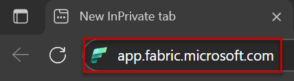
 
2. Enter the user name as Main user and click on **Submit**.

  
 

3. Enter the password  and click on **Sign in**.
 
 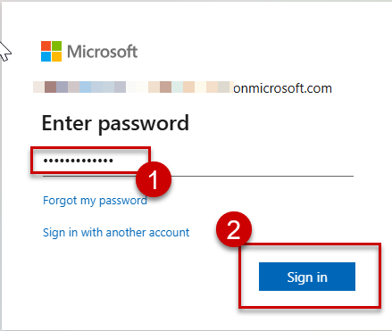 

 
4. Select the **checkbox** to disable the message in future, and click on **Yes** button.
 
 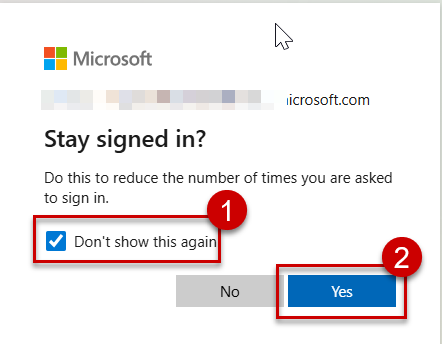
 
5. Click on **Workspaces** from  the left menu, and select **SQL Database in Fabric**.

  
 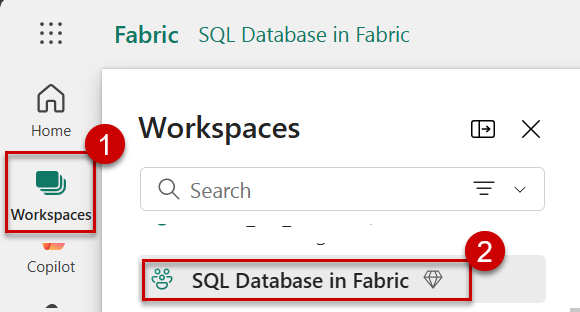
 
6. Click on **Manage_access** from the top right corner.
 
 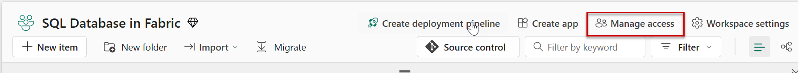
 
7. Click on **Add people or groups** button.
 
 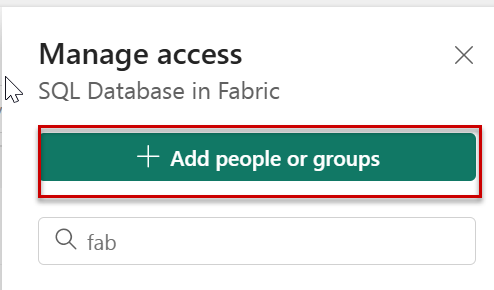
 
8. Search for **AIAP Demo User 002** user in the search box, select the user from the dropdown list, make sure that the **Viewer** access is selected, and then click on **Add**.
  
 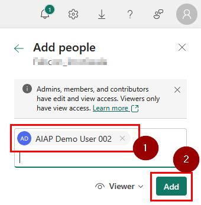
 
9. Wait till you get a success message like below. This might take a minute. Click on the **Close** icon.

 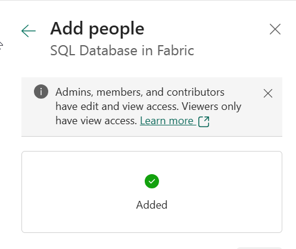
 
10. Hover to the right of **Fabcon_database** to find the **three dots** and click on it.
 
11. Scroll down and select **Manage permissions**.
 
 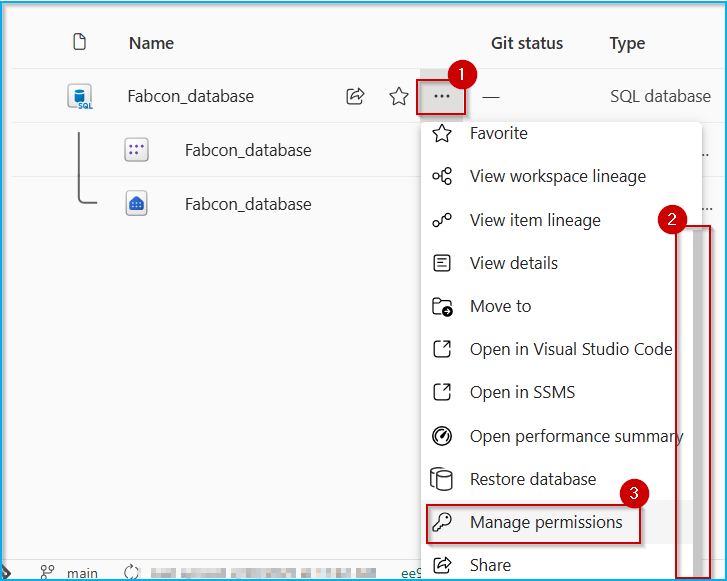
 
12. Type **AIAP Demo User 002** in the search box, and notice the permissions assigned to the users.
 
  
 
 
 Read, ReadData permissions allows user to can connect to Fabcon_database and read all data from it.

>**Note:** You can follow the same procedure to add other users under Viewer access.

13. Let us now implement **Dynamic Data Masking** on the customer table to check how the viewer access for **Security user (AIAP.user002@fabcon25eu.onmicrosoft.com)** actually works on the tables in terms of Security.
  Open the **Fabcon_database**. Open the new query.

 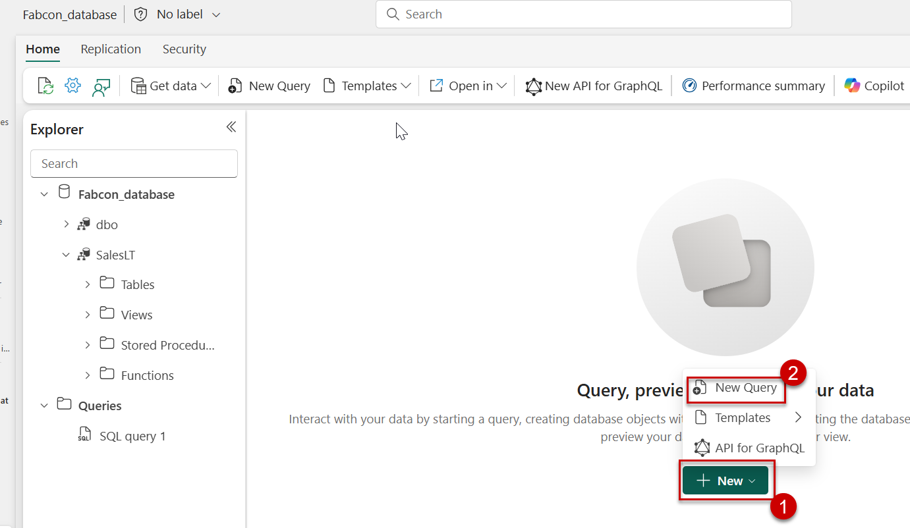

14. Paste the below query and run the script.

````
Select Top 100 CustomerID,
COALESCE(FirstName,MiddleName,LastName) as FullName,
EmailAddress,Phone  
into [SalesLT].[CustomerPII] From [SalesLT].[Customer]

````
 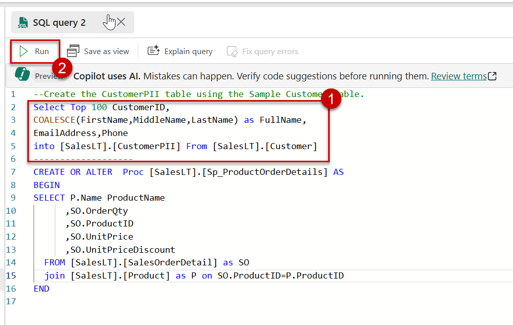

15. Paste the below query and run the script.

````
CREATE OR ALTER  Proc [SalesLT].[Sp_ProductOrderDetails] AS    
BEGIN
SELECT P.Name ProductName
      ,SO.OrderQty
      ,SO.ProductID
      ,SO.UnitPrice
      ,SO.UnitPriceDiscount
  FROM [SalesLT].[SalesOrderDetail] as SO
  join [SalesLT].[Product] as P on SO.ProductID=P.ProductID  
END
 
````
 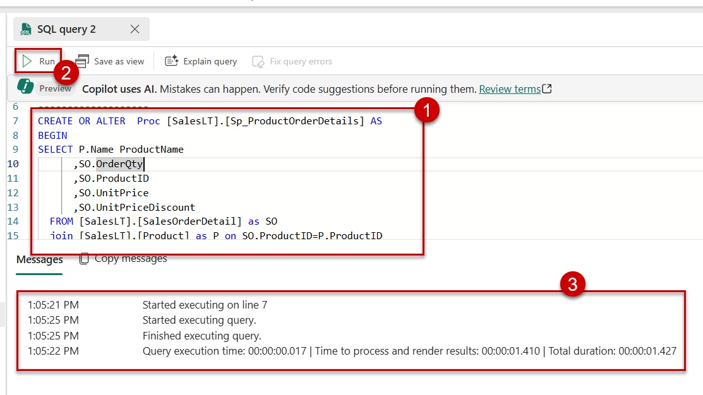

16. Open a new incognito window, and type **app.fabric.microsoft.com** and press **Enter**.

 
 
17. Enter the user name of **Security user(AIAP.user002@fabcon25eu.onmicrosoft.com)** and click on **Submit**.
  
 
 
18. Enter the password  and click on **Sign in**.
 
 
 
19. Select the **checkbox** to disable the message in future, and click on **Yes** button.
 
 
 
20. Click on **Workspaces** from  the left menu, and select **SQL Database in Fabric**.
 
 

21. Open the **Fabcon_database**. Open the new query.

 

22. Paste the below query and run the script.Please check the values for **EmailAddrress** and **Phone** Column.
 
 ````
 select * from  [SalesLT].[CustomerPII]     

 ````

 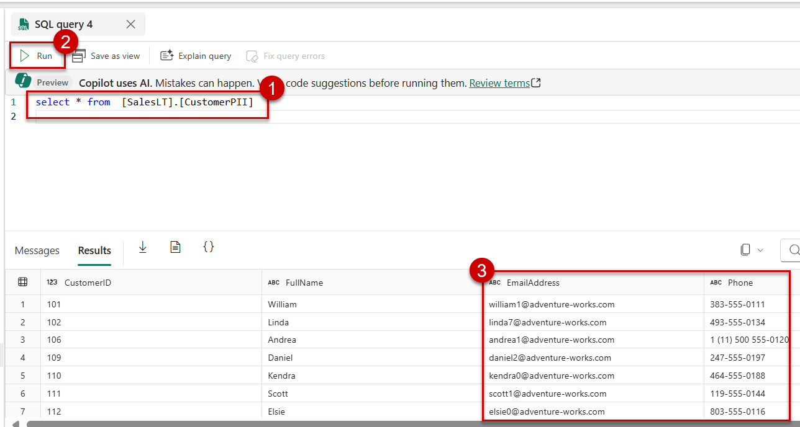

23. Switch back to the other Incognito window where you have logged in with **main user(Admin access)**.

24. Select the new query. Paste the below query and run it.

````

/*  Dynamic data masking helps prevent unauthorized access to sensitive data by enabling customers
    to designate how much of the sensitive data to reveal with minimal impact on the application layer.
    Let see how */
Alter Table [SalesLT].[CustomerPII]      
ALTER COLUMN [EmailAddress] ADD MASKED WITH (FUNCTION = 'email()')        
ALTER TABLE [SalesLT].[CustomerPII]
ALTER COLUMN [Phone] ADD MASKED WITH (FUNCTION = 'partial(0,"XXXX",4)')  

````
  
 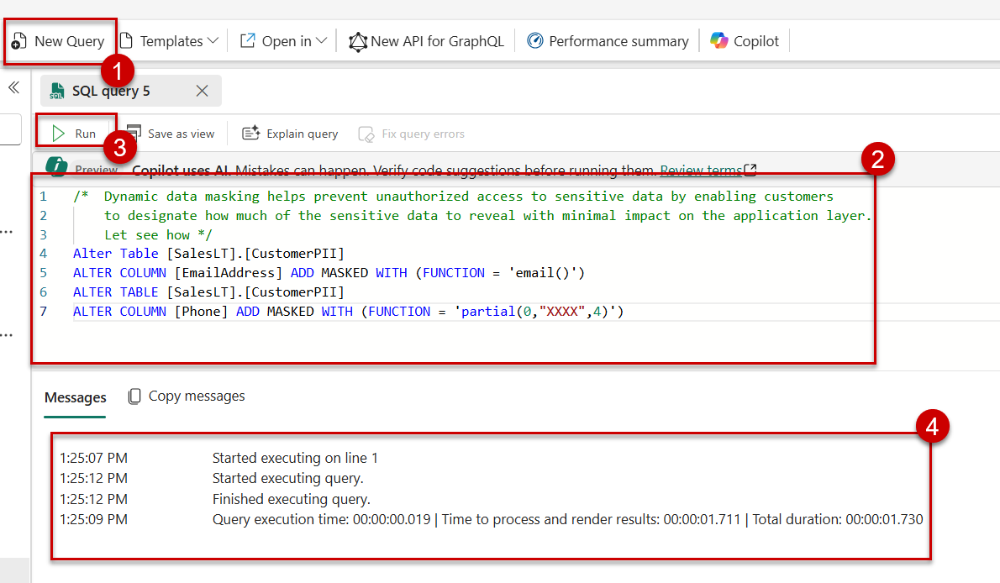

25. Switch back to the **Security user** Incognito Window (viewer access). Refresh the page and run the select query again. You will notice that the security user will see the **EmailAddress** and **Phone** columns masked.

  
 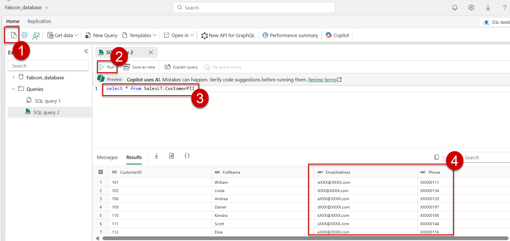

### Task : Manage fine-grain access using SQL native access controls​
 
 Unlike workspace roles you used in the previous task, SQL native access controls allow you to closely align authorization settings with the real needs of your user and adhere to the principle of least privilege. You configure SQL native access controls in two ways: by using the Manage SQL Security UI in Microsoft Fabric portal or with Transact-SQL.
 
 
#### Activity: Access as Workspace Admin to assign permissions using Open Manage SQL Security.
 
1. Open a new incognito window, and type **app.fabric.microsoft.com** and press **Enter**.
 
  
 
 
2. Enter the user name as Main user and click on **Submit**.
 
 
 
3. Enter the password  and click on **Sign in**.
 
  
 
 
4. Select the **checkbox** to disable the message in future, and click on **Yes** button.
 
 
 
5. Click on **Workspaces** from  the left menu, and select **SQL Database in Fabric**.
  
 
 
6. Open the **Fabcon_database**. 

7. Click on **Security** from the top menu, select **Manage SQL Security**, and then click on **New Role** button. 
  
 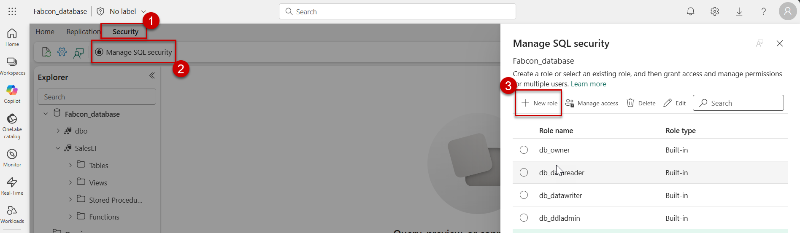
 
8. Enter the name as **custom_role** in the **Role name** textbox, then select the **Select**  checkbox against the **SalesLT** schema, and click on **Save** button.
 
 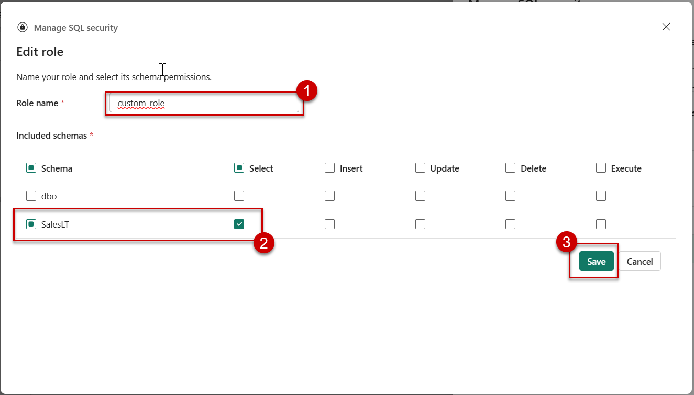

9. Select the **custom_role** radio button, and click on **Manage access**.

 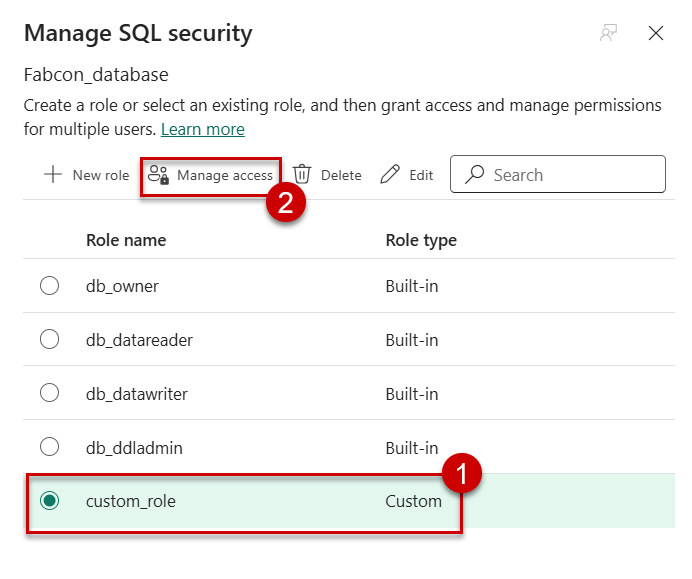
 
10. Search for **AIAP Demo User 002** user from the **Add people, groups or apps** text box, then select the result, and click on **Add** button.

  
 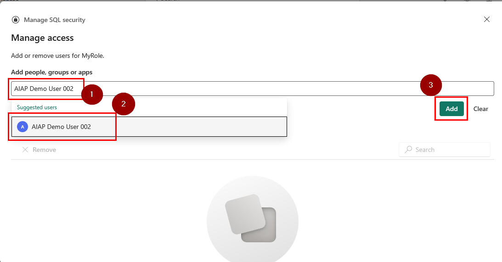
 
11. Click on **Save** button.
 
 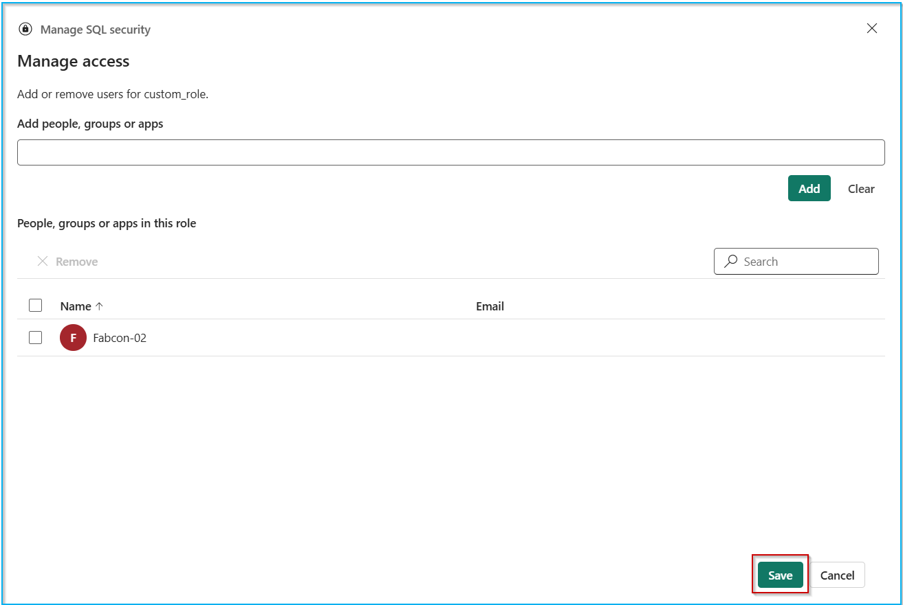
 
 We have successfully granted Read permission (to connect to database), select access on **SalesLT** schema of **Fabcon_database** to Security user **AIAP Demo User 002**.

12. Let us test the read permissions for Security user.

13. Open a new incognito window, and type **app.fabric.microsoft.com** and press **Enter**.

 
 
14. Enter the user name of **Security user(AIAP.user002@fabcon25eu.onmicrosoft.com)** and click on **Submit**.
  
 
 
15. Enter the password  and click on **Sign in**.
 
 
 
16. Select the **checkbox** to disable the message in future, and click on **Yes** button.
 
 
 
17. Click on **Workspaces** from  the left menu, and select **SQL Database in Fabric**.
 
 
 
18. Open the **Fabcon_database**. Open the new query. 
  
 

19. Paste the below query and run the script.
 
 ````
 [SalesLT].[Sp_ProductOrderDetails]     

 ````
 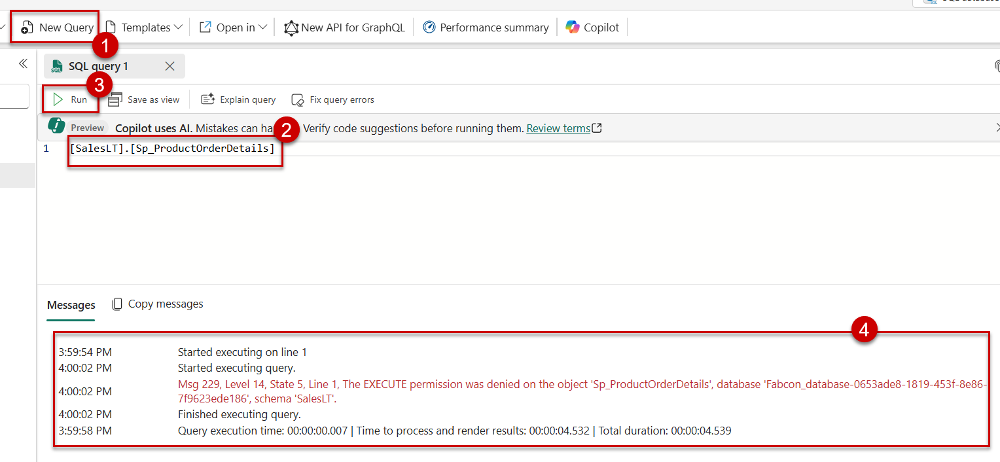

20. The query fails as the Security user doesn't have execute permissions. Let us update the Security and enable **Execute** permission for the **Security user(AIAP.user002@fabcon25eu.onmicrosoft.com)**.

21. Navigate back to the other Incognito window where you have logged in using **main user(Admin access)**.

22. Open the **Fabcon_database**.  

23. Click on **Security** from the top menu, select **Manage SQL Security**. Select the **custom_role** and then click on **Edit**.
 
 

24. Click on the **Execute** permissions check box and click on **Save**. This adds Execute permission to the security user on Fabcon SalesLT tables.

  
 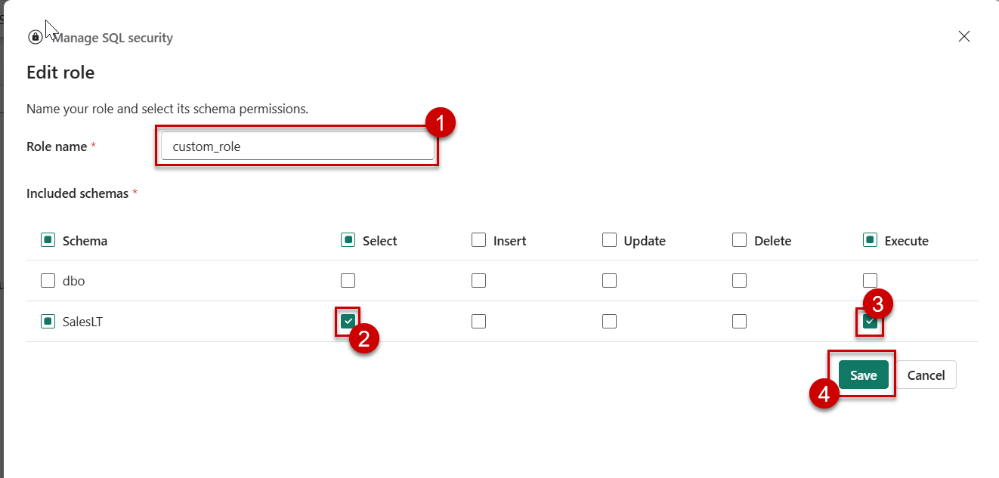

25. Switch back to the **Security user** Incognito Window (viewer access). Refresh the page and run the select query again.

 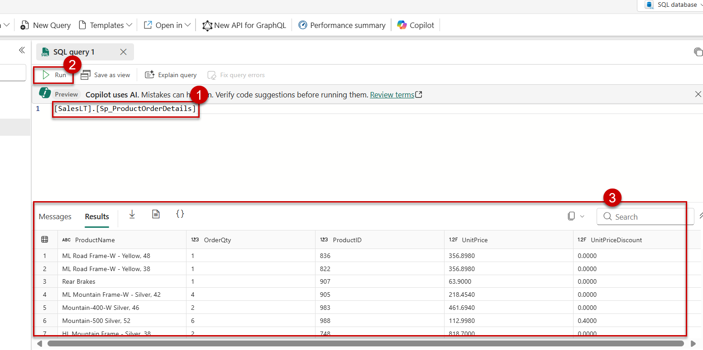

26. The above procedure exeuctes this time as the Security user is granted **Execute** permission.


 #### Activity: Access as Workspace Admin to assign Contributor workspace permission to other user.
 
1. Open a new incognito window, and type **app.fabric.microsoft.com** and press **Enter**.
 
 
 
2. Enter the user name as Main user and click on **Submit**.
  
 

 
3. Enter the password  and click on **Sign in**.

  
 
4. Select the **checkbox** to disable the message in future, and click on **Yes** button.
 
 
 
5. Click on **Workspaces** from  the left menu, and select **SQL Database in Fabric**.
 
 
 
6. Click on **Manage_access** from the top right corner.

 
  
7. Search for **AIAP.user002** user in the search box, select the **dropdown arrow** next to Viewer, click on **Contributor** access, and then click on **Close** icon.
 

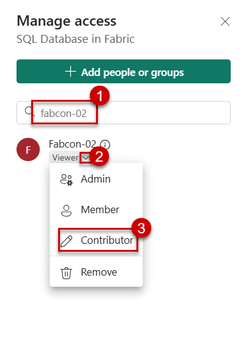
 
8. Hover to the right of **Fabcon_database** to find the **three dots** and click on it.
 
9. Scroll down and select **Manage permissions**.


 
 
10. Type **AIAP.user002** in the search box, and notice the permissions assigned to the users.
 

 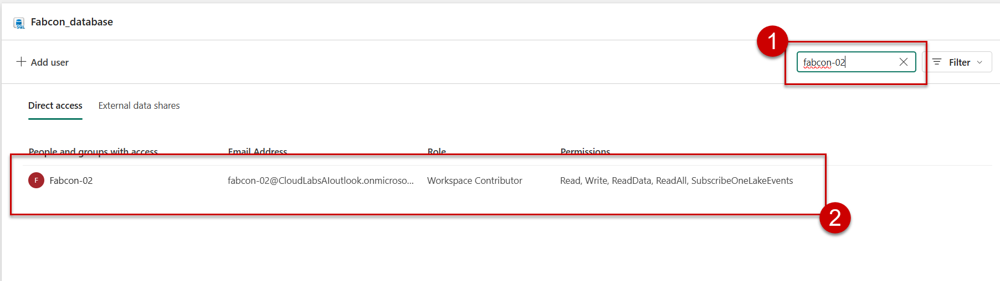
 
 The additional Write permission allows user to have full administrative access to Fabcon_database.
 
 
 #### Activity: Access as Workspace Admin to assign permissions using T-SQL.

 **Note:** You can execute the below sql queries to grant permissions.Providing a sample below.

 1. Switch back to the previous tab logged in with admin user **Main user (Admin access)**.
 
 2. Now, let us provide update access on **dbo** schema using T-SQL.
 
 3. Click on **New query**, paste the below code in the query editor, click on **Run** icon.
 
 ```
 GRANT UPDATE ON SCHEMA::dbo TO [AIAP.user002@fabcon25eu.onmicrosoft.com];
 ```

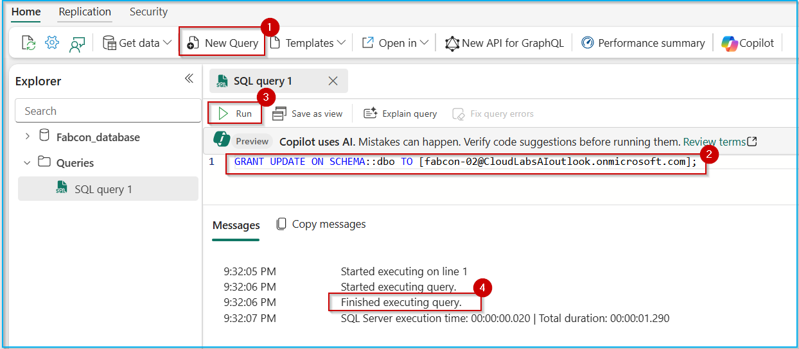


In this exercise, you have learned how to manage access control in Microsoft Fabric using Workspace roles and SQL native access controls. You have gained practical experience in:
 
- Understanding the four workspace roles (Admin, Member, Contributor, and Viewer) and their corresponding database permissions.
- Configuring SQL native access controls using the Manage SQL Security UI and Transact-SQL commands.

With this knowledge, you can now effectively manage user permissions and secure SQL Databases within Microsoft Fabric. You are ready to move on to the next exercise 
