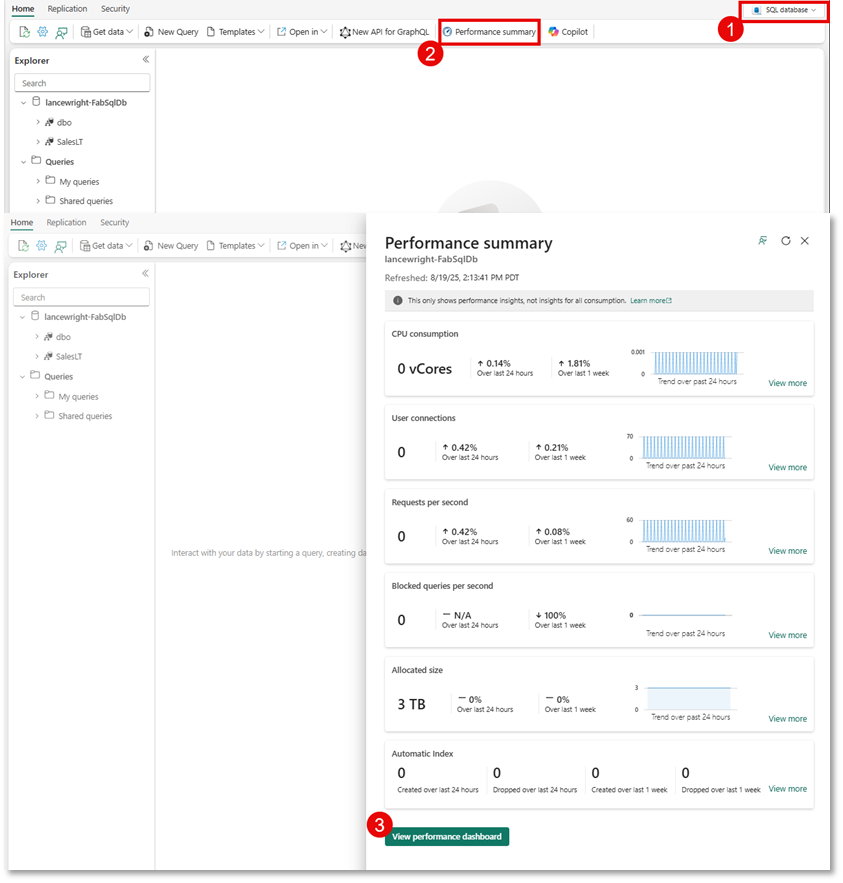
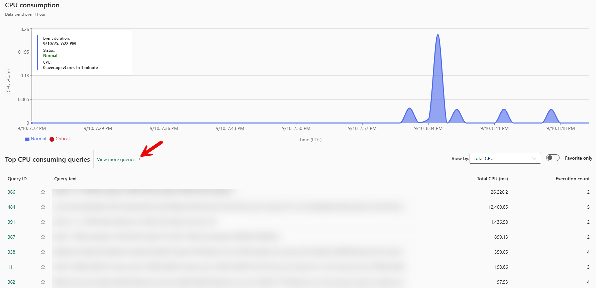
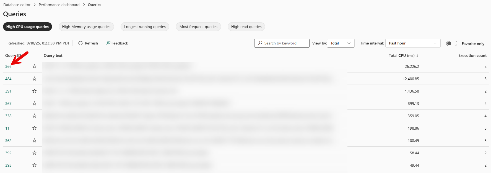
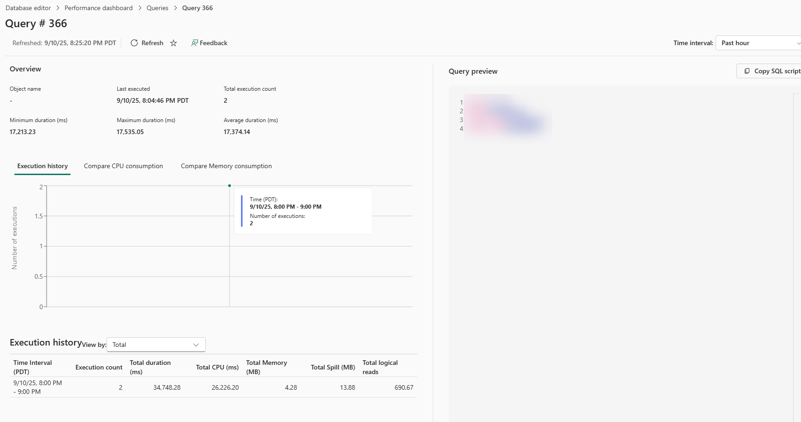
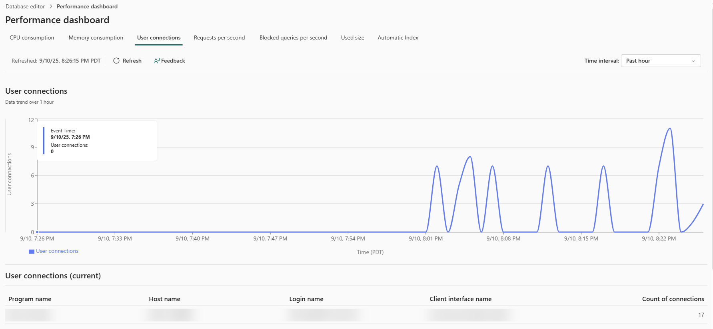
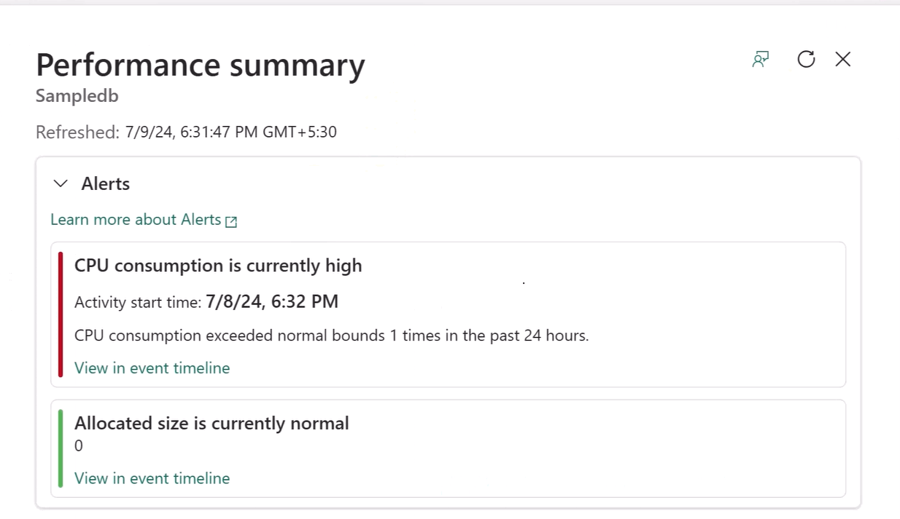
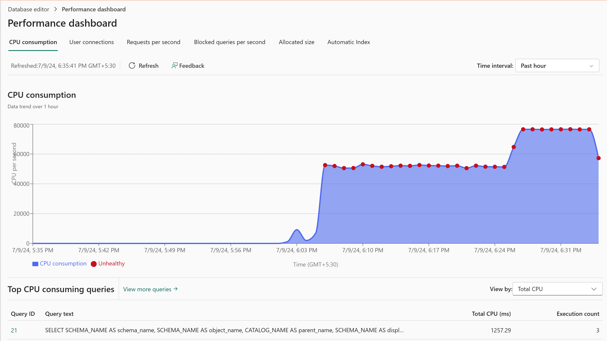

# Workshop: SQL database in Microsoft Fabric

## Performance

#### A Microsoft Workshop from the SQL Server Team

In this module, you will learn about managing the lifecycle of your application using source control. You will also learn how to monitor and maintain your SQL database in Fabric.

You'll cover these topics in this module:

1. [Find your highest CPU consuming queries using performance dashboard](../06%20-%20Performance%20Monitoring/06%20-%20Performance%20Monitoring.md#61-find-your-highest-cpu-consuming-queries-using-performance-dashboard)
2. [Track query details and view query performance within performance dashboard](../06%20-%20Performance%20Monitoring/06%20-%20Performance%20Monitoring.md#62-track-query-details-and-see-performance-history)
3. [Investigate User Connections on Performance Dashboard](../06%20-%20Performance%20Monitoring/06%20-%20Performance%20Monitoring.md#63-investigate-user-connections-on-performance-dashboard)
4. [Learn About Alerts in Performance Dashboard](../06%20-%20Performance%20Monitoring/06%20-%20Performance%20Monitoring.md#64-learn-about-alerts-in-performance-dashboard)
5. [Explore Performance Dashboard](../06%20-%20Performance%20Monitoring/06%20-%20Performance%20Monitoring.md#65-explore-performance-dashboard)

### 10.1 Find Your Highest CPU Consuming Queries Using Performance Dashboard

As your queries run in your SQL database in Fabric, the system collects performance metrics to display in the Performance Dashboard. It displays the performance status of the database, and you can use the Performance Dashboard to view database performance metrics, identify performance bottlenecks, and find solutions to performance issues.

You will now review the information in the Performance Dashboard on your system.

1. On the Home toolbar in the Query Editor window, select **Performance summary**.
2. On the right side of your window, the Performance Summary will open. This gives you a high-level overview of the database's current performance.
3. At the bottom, you will see a green button that says **View performance dashboard**.  Click this to open the full dashboard experience.

 

You will notice that by default, the performance dashboard has selected the default time interval of the Past 24 hours.  By clicking the drop down on the top right next to **Time interval:**, you can select any time interval of interest.

Scrolling to the bottom of this pane (below the chart) you can see a list of the **Top CPU consuming queries**.  You can click **View more queries ->** to see a complete list.

 

From this view, you can select the `star` icon to favorite, or track, a query.  You can also click on the `Query ID` on the far left to see details about a given query.

 

### 10.2 Track query details and see performance history

**Note: The query details pane for an individual query contains data gathered from [`Query Store`](https://learn.microsoft.com/sql/relational-databases/performance/monitoring-performance-by-using-the-query-store?view=sql-server-ver16).*

1. Now that you have selected a query and are drilling into details, you will see several items of interest.  On the right is the `query preview` which contains the query text.  Below this, you can copy the query and open it in the query editor.
2. You can also see how many times the query has been executed.  This can help you determine if a query has been run more often than expected - or if you have seen a sudden increase in query executions.
3. You can also select **Compare Performance** to compare the query's performance across different time intervals.
4. Once you have done this, feel free to play around with more queries, and then select **Performance dashboard** at the top of the screen in **Database editor \> Performance dashboard \> Queries \> ...**

 

### 10.3 Investigate User Connections on Performance Dashboard

1. From the home page of performance dashboard, select the tab for **User Connections**.
2. In this view, you can see how many connections have been happening over time, and where the connections are coming from.

Use this information to troubleshoot if you have a connection leak in your application, or if you are creating more connections than expected.

 

### 10.4 Learn About Alerts in Performance Dashboard

Another performance feature in SQL database in Fabric is Alerts. These are automatically generated alerts with pre-set criteria that provide Ongoing Alerts, which are raised when the database is facing a problem. This alert is represented by a horizontal Notification bar. Another set of alerts are the Pending Alerts which are stored in the system, indicating that analysis is needed for a database parameter reaching a critical state.

 

Once you select the link for an alert, the Performance Summary provides a summary of alerts and recent metrics of the database. From here, you can drill into the event timeline for more information.

When the database reaches a critical state of CPU consumption (or any other factor which raises an alert), you can see Unhealthy points marked on the CPU consumption tab's graph, marking points where the CPU consumption has crossed the threshold value. The time interval is configurable and defaults to 24 hours.

 

### 10.5 Explore Performance Dashboard

You should now feel empowered to explore this dashboard view to see what is (or isn't) happening in your database, and to leverage it to troubleshoot issues.

---

Congratulations! You have completed this workshop on SQL database in Microsoft Fabric. You have worked with many different types of artifacts within Microsoft Fabric - many of them directly relating to SQL database in Microsoft Fabric.  You have also built a small application that leverages the power of having AI capabilities within SQL, and seen how the Fabric ecosystem makes end-to-end development very smooth.

---
